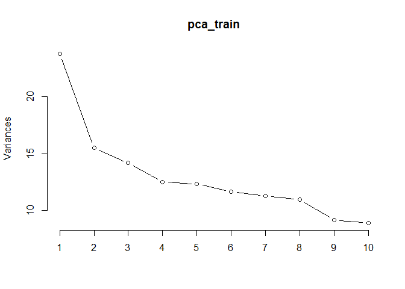
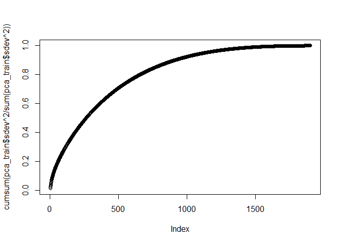

Question5
================
Neha Anna John
18/08/2019

### Declaring libraries

``` r
library(tm) 
```

    ## Loading required package: NLP

``` r
library(magrittr)
library(slam)
library(proxy)
```

    ## 
    ## Attaching package: 'proxy'

    ## The following objects are masked from 'package:stats':
    ## 
    ##     as.dist, dist

    ## The following object is masked from 'package:base':
    ## 
    ##     as.matrix

``` r
library(caret)
```

    ## Loading required package: lattice

    ## Loading required package: ggplot2

    ## 
    ## Attaching package: 'ggplot2'

    ## The following object is masked from 'package:NLP':
    ## 
    ##     annotate

### Declaring training and testing data set and getting data from each folder within training and test folders. Also, changing them the naming convention for representation. Post this, training and testing corpus is created

``` r
readerPlain = function(fname){
                readPlain(elem=list(content=readLines(fname)), 
                            id=fname, language='en') }

## Training and Test dataset
setwd("C:/Users/nehaa/Desktop/Predictive Modelling/GitFolder/STA380/data")
trainlist = Sys.glob('ReutersC50/C50train/*/*.txt')
train = lapply(trainlist, readerPlain) 

testlist = Sys.glob('ReutersC50/C50test/*/*.txt')
test = lapply(testlist, readerPlain)

mynames = trainlist %>%
    { strsplit(., '/', fixed=TRUE) } %>%
    { lapply(., tail, n=2) } %>%
    { lapply(., paste0, collapse = '') } %>%
    unlist

mynames_test = testlist %>%
    { strsplit(., '/', fixed=TRUE) } %>%
    { lapply(., tail, n=2) } %>%
    { lapply(., paste0, collapse = '') } %>%
    unlist

names(train) = mynames
names(test) = mynames

authors_train = trainlist %>%
{ strsplit(., '/', fixed=TRUE) } %>%
{ lapply(., function(x) x[3]) } %>%
{ lapply(., paste0, collapse = '') } %>%
  unlist

authors_test = testlist %>%
{ strsplit(., '/', fixed=TRUE) } %>%
{ lapply(., function(x) x[3]) } %>%
{ lapply(., paste0, collapse = '') } %>%
  unlist

train_raw = Corpus(VectorSource(train))
test_raw = Corpus(VectorSource(test))
```

### Now, the data set needs to cleaned. Following operations are performed: Conversion to lowercase, removing numbers and punctuation and stripping whitespace.

``` r
my_documents = train_raw
my_documents = tm_map(my_documents, content_transformer(tolower))
```

    ## Warning in tm_map.SimpleCorpus(my_documents, content_transformer(tolower)):
    ## transformation drops documents

``` r
my_documents = tm_map(my_documents, content_transformer(removeNumbers)) 
```

    ## Warning in tm_map.SimpleCorpus(my_documents,
    ## content_transformer(removeNumbers)): transformation drops documents

``` r
my_documents = tm_map(my_documents, content_transformer(removePunctuation)) 
```

    ## Warning in tm_map.SimpleCorpus(my_documents,
    ## content_transformer(removePunctuation)): transformation drops documents

``` r
my_documents = tm_map(my_documents, content_transformer(stripWhitespace)) 
```

    ## Warning in tm_map.SimpleCorpus(my_documents,
    ## content_transformer(stripWhitespace)): transformation drops documents

``` r
my_documents_test = test_raw
my_documents_test = tm_map(my_documents_test, content_transformer(tolower))
```

    ## Warning in tm_map.SimpleCorpus(my_documents_test,
    ## content_transformer(tolower)): transformation drops documents

``` r
my_documents_test = tm_map(my_documents_test, content_transformer(removeNumbers)) 
```

    ## Warning in tm_map.SimpleCorpus(my_documents_test,
    ## content_transformer(removeNumbers)): transformation drops documents

``` r
my_documents_test = tm_map(my_documents_test, content_transformer(removePunctuation)) 
```

    ## Warning in tm_map.SimpleCorpus(my_documents_test,
    ## content_transformer(removePunctuation)): transformation drops documents

``` r
my_documents_test = tm_map(my_documents_test, content_transformer(stripWhitespace))
```

    ## Warning in tm_map.SimpleCorpus(my_documents_test,
    ## content_transformer(stripWhitespace)): transformation drops documents

### Stopwords are removed from the test and training corpus using stopwords(“en”)

``` r
my_documents = tm_map(my_documents, content_transformer(removeWords), stopwords("en"))
```

    ## Warning in tm_map.SimpleCorpus(my_documents,
    ## content_transformer(removeWords), : transformation drops documents

``` r
my_documents_test = tm_map(my_documents_test, content_transformer(removeWords), stopwords("en"))
```

    ## Warning in tm_map.SimpleCorpus(my_documents_test,
    ## content_transformer(removeWords), : transformation drops documents

### Removing terms which are sparse(not present in atleast 2% of the documents). Comparing the dictionary of words in test matrix with training matrix and ensuring it contains the same set of words using control

``` r
train_matrix = DocumentTermMatrix(my_documents)
train_matrix = removeSparseTerms(train_matrix, 0.98)
test_matrix = DocumentTermMatrix(my_documents_test, control = list(dictionary=Terms(train_matrix)))

train_matrix
```

    ## <<DocumentTermMatrix (documents: 2500, terms: 1917)>>
    ## Non-/sparse entries: 369030/4423470
    ## Sparsity           : 92%
    ## Maximal term length: 18
    ## Weighting          : term frequency (tf)

### Creating tf idf matrices for training and test dataset

``` r
tfidf_train = weightTfIdf(train_matrix)
tfidf_test = weightTfIdf(test_matrix)
```

### Dimension reduction using PCA, Scrubbing the matrices from missing data and then performing prcomp.. The components created are then plotted. The plot shows that about 75% variance is explained through 700 components. Hence, utilizing the same.

``` r
X_train = as.matrix(tfidf_train)
X_test = as.matrix(tfidf_test)

scrub_cols = which(colSums(X_train) == 0)
scrub_cols_test = which(colSums(X_test) == 0)

X_train = X_train[,-scrub_cols]
X_test = X_test[,-scrub_cols_test]

pca_train = prcomp(X_train, scale=TRUE)
pca_test=predict(pca_train,newdata = X_test)
plot(pca_train, type='line') 
```

<!-- -->

``` r
plot(cumsum(pca_train$sdev^2/sum(pca_train$sdev^2)))
```

<!-- -->

``` r
names(pca_train)
```

    ## [1] "sdev"     "rotation" "center"   "scale"    "x"

\#\#\#Creating truncated training and test dataset using 700 PCA
components

``` r
df_train_trunc = data.frame(pca_train$x[,1:700])
df_train_trunc['author'] = authors_train
df_test_trunc = data.frame(pca_test[,1:700])
df_test_trunc['author']=authors_test
```

### Leveraging random forest to make predictions on test data set, giving an accuracy of 53%

``` r
library('randomForest')
```

    ## randomForest 4.6-14

    ## Type rfNews() to see new features/changes/bug fixes.

    ## 
    ## Attaching package: 'randomForest'

    ## The following object is masked from 'package:ggplot2':
    ## 
    ##     margin

``` r
rf_model = randomForest(as.factor(author) ~ ., data=df_train_trunc, ntree=500, mtry=8, importance=TRUE)
rf_predictions = predict(rf_model,df_test_trunc)
cm = caret::confusionMatrix(rf_predictions,as.factor(df_test_trunc$author))
accuracy = cm$overall['Accuracy']
accuracy
```

    ## Accuracy 
    ##   0.5172

### Leveraging Naive Bayes classifier to make predictions on test data set, giving an accuracy of 42.4%

``` r
library('e1071')
nb_model = naiveBayes(as.factor(author) ~., data=df_train_trunc)
nb_predictions = predict(nb_model,df_test_trunc)
```

    ## Warning in data.matrix(newdata): NAs introduced by coercion

``` r
cm = caret::confusionMatrix(nb_predictions,as.factor(df_test_trunc$author))
accuracy <- cm$overall['Accuracy']
accuracy
```

    ## Accuracy 
    ##    0.424

### Out of the two models, random forest turns out to be a better predictor of the author for the documents in the test dataset. Other methods of classification that can be utilized are knn and other tree based methods. For the purpose of this analysis, we have considered the above two methods.
