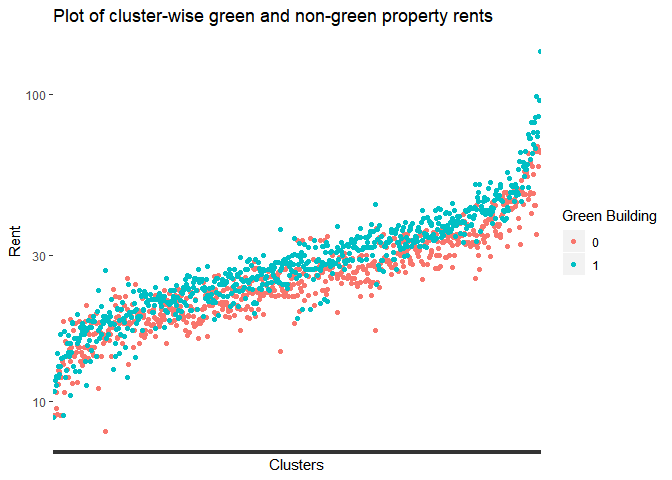
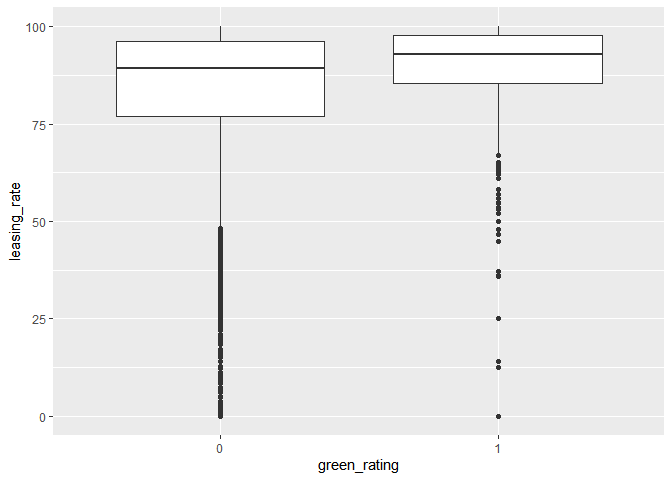
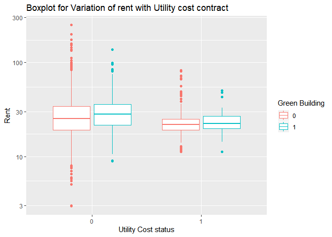
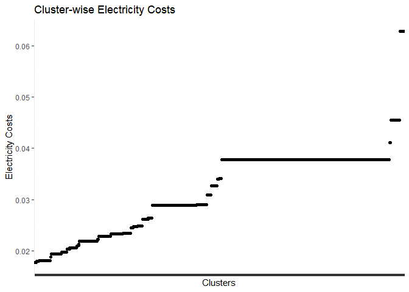
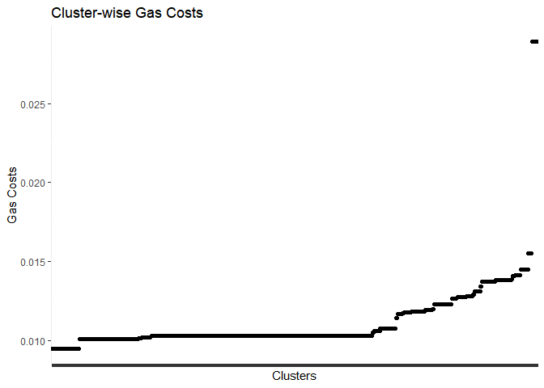
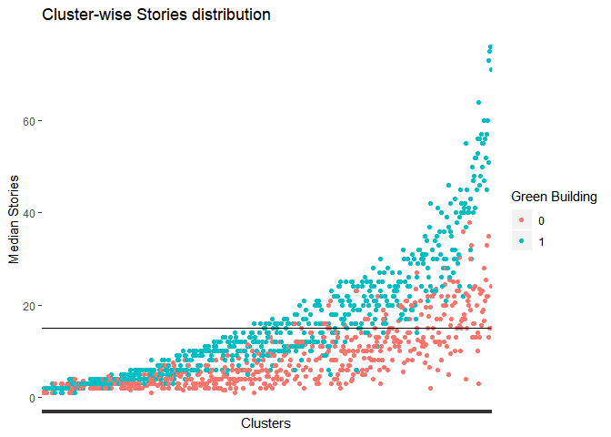

Question 1
================
Shivank Sood
8/18/2019

\#I disagree with the on-staff stats guru on some points mentioned
below: \#Which Cluster is the location in:  
\#\#The excel guru looks at the rent of the whole market and fails to
consider cluster in the whole economic calculation. Each cluster has a
different rent spectrum. Moreover, the green building in each cluster
has a different trend of market rate as compared to the non-green
buildings in the same cluster. In some clusters, green buildings are
less expensive than the others and in others the difference is very
different from others. So $2.6 more per squarefoot is a vague estimate.
It can easily be more or less depending on the cluster.
<!-- --> \#Can we
assume minimum occupancy rate of 90%? \#\#Half of the properties have
below 90% occupancy rate. Though green properties are more occupied than
non-green but still 90% is a very large assumption on part of the
stats-guru. Moreover, some clusters don’t have that much occupancy,
which can mean that there is not much demand in those clusters ruling
out the idea of investing in those clusters.

    ##    Min. 1st Qu.  Median    Mean 3rd Qu.    Max. 
    ##    0.00   77.85   89.53   82.61   96.44  100.00

<!-- --><!-- -->
\#Who pays the utility bills? \#\#The stats-guru does not take into
account whether the utility bills are paid by renter or not. Rents are
obviously higher for utility cost included in rent. There seem to be
both green and non-green buildings in the two categories. We need to
account for utility charges if either case is there.
<!-- -->
\#Electricity cost and Gas costs \#\#Both Electricity and Gas costs are
different for different clusters.
<!-- -->

<!-- --> \#Do all
clusters have equally tall buildings? \#\#Each cluster has a different
range of stories of a building. As a trend, green buildings are usually
taller cluster-wise. The trend in the story reflects the demand in the
area and there also might be additional legal restrictions in some areas
as well. <!-- -->
\#CONCLUSION  
\#\#The recommendation put forward by the stats guru seems pretty vague
and incomplete. He fails to consider factors which might have an
economic impact both positively and negatively. \#\#\#He did not
consider the cluster-wise distribution of rents and then the difference
of green and non-green property’s rent.  
\#\#\#His assumption of atleast 90% occupancy seems vague.  
\#\#\#He does not account utility costs nor does he consider whether it
is included in the rent or not.  
\#\#\#All clusters do not have high sky scrapers. One hypothesis is that
it can indicate demand or legal restrictions.
