Predictive Modelling - Part2
================
Vikrant Vaidya
8/10/2019

## R Markdown

This is an R Markdown document. Markdown is a simple formatting syntax
for authoring HTML, PDF, and MS Word documents. For more details on
using R Markdown see <http://rmarkdown.rstudio.com>.

When you click the **Knit** button a document will be generated that
includes both content as well as the output of any embedded R code
chunks within the document. You can embed an R code chunk like this:

    ## Loading required package: dplyr

    ## 
    ## Attaching package: 'dplyr'

    ## The following objects are masked from 'package:stats':
    ## 
    ##     filter, lag

    ## The following objects are masked from 'package:base':
    ## 
    ##     intersect, setdiff, setequal, union

    ## Loading required package: lattice

    ## Loading required package: ggformula

    ## Loading required package: ggplot2

    ## Loading required package: ggstance

    ## 
    ## Attaching package: 'ggstance'

    ## The following objects are masked from 'package:ggplot2':
    ## 
    ##     geom_errorbarh, GeomErrorbarh

    ## 
    ## New to ggformula?  Try the tutorials: 
    ##  learnr::run_tutorial("introduction", package = "ggformula")
    ##  learnr::run_tutorial("refining", package = "ggformula")

    ## Loading required package: mosaicData

    ## Loading required package: Matrix

    ## Registered S3 method overwritten by 'mosaic':
    ##   method                           from   
    ##   fortify.SpatialPolygonsDataFrame ggplot2

    ## 
    ## The 'mosaic' package masks several functions from core packages in order to add 
    ## additional features.  The original behavior of these functions should not be affected by this.
    ## 
    ## Note: If you use the Matrix package, be sure to load it BEFORE loading mosaic.

    ## 
    ## Attaching package: 'mosaic'

    ## The following object is masked from 'package:Matrix':
    ## 
    ##     mean

    ## The following object is masked from 'package:ggplot2':
    ## 
    ##     stat

    ## The following objects are masked from 'package:dplyr':
    ## 
    ##     count, do, tally

    ## The following objects are masked from 'package:stats':
    ## 
    ##     binom.test, cor, cor.test, cov, fivenum, IQR, median,
    ##     prop.test, quantile, sd, t.test, var

    ## The following objects are masked from 'package:base':
    ## 
    ##     max, mean, min, prod, range, sample, sum

    ## Loading required package: xts

    ## Loading required package: zoo

    ## 
    ## Attaching package: 'zoo'

    ## The following objects are masked from 'package:base':
    ## 
    ##     as.Date, as.Date.numeric

    ## Registered S3 method overwritten by 'xts':
    ##   method     from
    ##   as.zoo.xts zoo

    ## 
    ## Attaching package: 'xts'

    ## The following objects are masked from 'package:dplyr':
    ## 
    ##     first, last

    ## Loading required package: TTR

    ## Registered S3 method overwritten by 'quantmod':
    ##   method            from
    ##   as.zoo.data.frame zoo

    ## Version 0.4-0 included new data defaults. See ?getSymbols.

    ## 
    ## Attaching package: 'gridExtra'

    ## The following object is masked from 'package:dplyr':
    ## 
    ##     combine

VISUAL STROY TELLING - FLIGHTS AT ABIA

We are going to take a look at the ABIA data from the eyes and interest
of a frequent flyer staying in Austin. As a frequent flyer I would want
to know -

1)  What percentage of flights in and out of Austin are delayed ?
2)  What is the average amount of times by which flights in and out of
    Austin get delayed?
3)  What are the Origin(flights to Austin) and Destination(flights from
    Austin) with the most cancellation blues?
4)  What causes these cancellations ?
5)  What are the airline carriers one should expect most delays with?
6)  Which are the best Origin/Dest to expect pre-time arrival/departures
    to/from Austin ?
7)  Which airports do I expect to spend the maximum time Taxing In and
    Out?
8)  What are the times of the day I should expect the maximum arrival
    and departure delays in/out of Austin?
9)  Are these trends better/worse on some days of the week? Whether I
    could beat this?

But first, PIPING GROUPING AND SUMMARISING the data.

``` r
abia = read.csv('ABIA.csv')

#Creating Flag Columns
abia <- abia %>% 
  mutate(arr_delay_flag = ifelse(abia$ArrDelay>0,1,0))

abia <- abia %>% 
  mutate(dep_delay_flag = ifelse(abia$DepDelay>0,1,0))

abia$Period_dep[(abia$DepTime >= 500) & (abia$DepTime < 1200)] <- "MORNING"
abia$Period_dep[(abia$DepTime >= 1200) & (abia$DepTime < 1800)] <- "AFTERNOON"
abia$Period_dep[(abia$DepTime >= 1800) | (abia$DepTime < 500)] <- "EVENING"

abia$Period_arr[(abia$ArrTime >= 500) & (abia$ArrTime < 1200)] <- "MORNING"
abia$Period_arr[(abia$ArrTime >= 1200) & (abia$ArrTime < 1800)] <- "AFTERNOON"
abia$Period_arr[(abia$ArrTime >= 1800) | (abia$ArrTime < 500)] <- "EVENING"

#% of DEPARTURES
#Grouping Delays by levels and Plotting
#BY MONTH
depdel_month = abia[(!is.na(abia$dep_delay_flag) & (abia$Origin=="AUS")),] %>%
  group_by(Month) %>%
  summarise(depdel.prt = (sum(dep_delay_flag)/count(Month))*100)

#BY DAY OF MONTH
depdel_dom = abia[(!is.na(abia$dep_delay_flag) & (abia$Origin=="AUS")),] %>%
  group_by(DayofMonth) %>%
  summarize(depdel.prt=(sum(dep_delay_flag)/count(DayofMonth))*100)


#BY DAY OF WEEK
depdel_dow = abia[(!is.na(abia$dep_delay_flag) & (abia$Origin=="AUS")),] %>%
  group_by(DayOfWeek) %>%
  summarize(depdel.prt=(sum(dep_delay_flag)/count(DayOfWeek))*100)


#% of ARRIVALS
#Grouping Delays by levels and Plotting
#BY MONTH
arrdel_month = abia[(!is.na(abia$arr_delay_flag) & (abia$Dest=="AUS")),] %>%
  group_by(Month) %>%
  summarize(arrdel.prt=(sum(arr_delay_flag)/count(Month))*100)

#BY DAY OF MONTH
arrdel_dom = abia[(!is.na(abia$arr_delay_flag) & (abia$Dest=="AUS")),] %>%
  group_by(DayofMonth) %>%
  summarize(arrdel.prt=(sum(arr_delay_flag)/count(DayofMonth))*100)

#BY DAY OF WEEK
arrdel_dow = abia[(!is.na(abia$arr_delay_flag) & (abia$Dest=="AUS")),] %>%
  group_by(DayOfWeek) %>%
  summarize(arrdel.prt=(sum(arr_delay_flag)/count(DayOfWeek))*100)


#2 - Plotting Avg Dep and Arrival Delays by Month/DayofMonth/DayofWeek
#Can get rid of flag use
#DEP DELAYS
mean_depdel_month = abia[((abia$dep_delay_flag==1)& (abia$Origin=="AUS")),] %>%
  group_by(Month) %>%
  summarise(mean.del = mean(DepDelay))

mean_depdel_dom = abia[((abia$dep_delay_flag==1)& (abia$Origin=="AUS")),] %>%
  group_by(DayofMonth) %>%
  summarise(mean.del = mean(DepDelay))

mean_depdel_dow = abia[((abia$dep_delay_flag==1)& (abia$Origin=="AUS")),] %>%
  group_by(DayOfWeek) %>%
  summarise(mean.del = mean(DepDelay))

#ARR DELAYS
mean_arrdel_month = abia[((abia$arr_delay_flag==1) & (abia$Dest=="AUS")),] %>%
  group_by(Month) %>%
  summarise(mean.del = mean(ArrDelay))

mean_arrdel_dom = abia[((abia$arr_delay_flag==1) & (abia$Dest=="AUS")),] %>%
  group_by(DayofMonth) %>%
  summarise(mean.del = mean(ArrDelay))

mean_arrdel_dow = abia[((abia$arr_delay_flag==1) & (abia$Dest=="AUS")),] %>%
  group_by(DayOfWeek) %>%
  summarise(mean.del = mean(ArrDelay))


#3 Cancelled Flights by Origin and Destination/Cancellation Code
orig_cancel = abia[((abia$Cancelled==1) & (abia$Dest=="AUS")),] %>%
  group_by(Origin,CancellationCode) %>%
  summarise(tot.cancel = sum(Cancelled))

dest_cancel = abia[((abia$Cancelled==1) & (abia$Origin=="AUS")),] %>%
  group_by(Dest,CancellationCode) %>%
  summarise(tot.cancel = sum(Cancelled))


#4 Unique Carrier with Carrier Delay
carrier_del = abia[abia$CarrierDelay>=0,] %>%
  group_by(UniqueCarrier) %>%
  summarise(mean.del = mean(CarrierDelay))
```

    ## Warning: Factor `UniqueCarrier` contains implicit NA, consider using
    ## `forcats::fct_explicit_na`

``` r
#5 Pre-time departures to Austin And Pre-time arrivals from Austin
pre_dep = abia[((!(abia$Origin=="AUS")) & (abia$DepDelay<0) & (!is.na(abia$DepDelay))),] %>%
  group_by(Origin) %>%
  summarise(cnt.dep = n() )

pre_arr = abia[((!(abia$Dest=="AUS")) & (abia$ArrDelay<0) & (!is.na(abia$ArrDelay))),] %>%
  group_by(Dest) %>%
  summarise(cnt.arr = n() )

#6 Mean Taxi-Out/In times by airport
taxi_out = abia[!is.na(abia$TaxiOut),] %>%
  group_by(Origin) %>%
  summarise(mean = mean(TaxiOut))

taxi_in = abia[!is.na(abia$TaxiIn),] %>%
  group_by(Dest) %>%
  summarise(mean = mean(TaxiIn))

#7 Delays by Time Period for both arrivals and departures - AUS

period_dep_del = abia[((!is.na(abia$DepDelay))&(abia$Origin=="AUS")),] %>%
  group_by(Period_dep) %>%
  summarise(mean.del = mean(DepDelay))

period_arr_del = abia[((!is.na(abia$ArrDelay))&(abia$Dest=="AUS")),] %>%
  group_by(Period_arr) %>%
  summarise(mean.del = mean(ArrDelay))

## By DOW Level

period_dep_del_dow = abia[((!is.na(abia$DepDelay))&(abia$Origin=="AUS")),] %>%
  group_by(DayOfWeek,Period_dep) %>%
  summarise(mean.del = mean(DepDelay))

period_arr_del_dow = abia[((!is.na(abia$ArrDelay))&(abia$Dest=="AUS")),] %>%
  group_by(DayOfWeek,Period_arr) %>%
  summarise(mean.del = mean(ArrDelay))
```

1)  What percentage of flights in and out of Austin are delayed ?

DEPARTURES

``` r
# BY MONTH
ggplot(depdel_month) + 
  geom_line(aes(x=Month, y=depdel.prt), color='blue') + 
  theme_bw(base_size=15) +
  scale_x_continuous(breaks = 1:12) +
  labs(title="% Departure Delays from Austin", 
       caption="Source: ABIA dataset 2008",
       y="Flight Delay %",
       x = "Month")
```

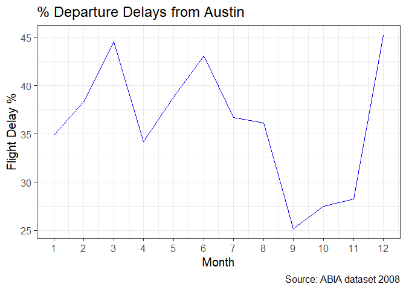<!-- -->

``` r
# BY DAY OF MONTH
ggplot(depdel_dom) + 
  geom_line(aes(x=DayofMonth, y=depdel.prt), color='blue') + 
  theme_bw(base_size=15) +
  scale_x_continuous(breaks = 1:31) +
  labs(title="% Departure Delays from Austin - Day of Month", 
       caption="Source: ABIA dataset 2008",
       y="Flight Delay %",
       x = "Day of Month") +
  theme(axis.text.x = element_text(angle=90, vjust=0.6))
```

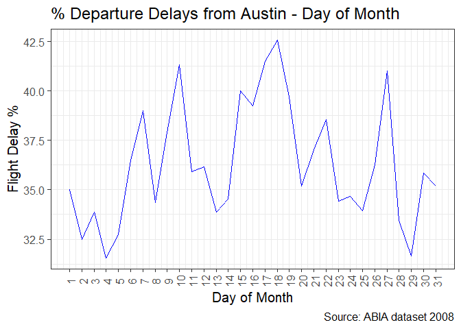<!-- -->

``` r
# BY DAY OF WEEK
ggplot(depdel_dow) + 
  geom_line(aes(x=DayOfWeek, y=depdel.prt), color='blue') + 
  theme_bw(base_size=15) +
  scale_x_continuous(breaks = 1:7) +
  labs(title="% Departure Delays from Austin - Day of Week", 
       caption="Source: ABIA dataset 2008",
       y="Flight Delay %",
       x = "Day of Week")
```

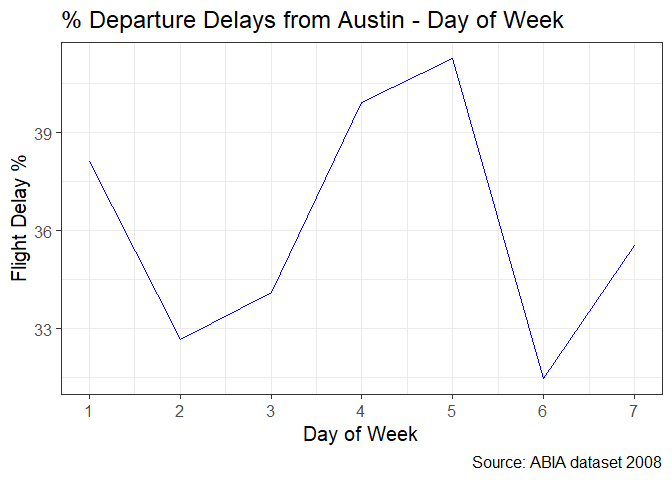<!-- -->

ARRIVALS

``` r
#BY MONTH
ggplot(arrdel_month) + 
  geom_line(aes(x=Month, y=arrdel.prt), color='red') + 
  theme_bw(base_size=15) +
  scale_x_continuous(breaks = 1:12) +
  labs(title="% Arrival Delays from Austin", 
       caption="Source: ABIA dataset 2008",
       y="Flight Delay %",
       x = "Month")
```

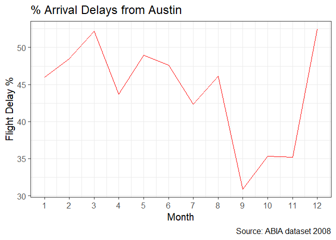<!-- -->

``` r
# BY DAY OF MONTH
ggplot(arrdel_dom) + 
  geom_line(aes(x=DayofMonth, y=arrdel.prt), color='red') + 
  theme_bw(base_size=15) +
  scale_x_continuous(breaks = 1:31) +
  labs(title="% Arrival Delays from Austin - Day of Month", 
       caption="Source: ABIA dataset 2008",
       y="Flight Delay %",
       x = "Day of Month") +
  theme(axis.text.x = element_text(angle=90, vjust=0.6))
```

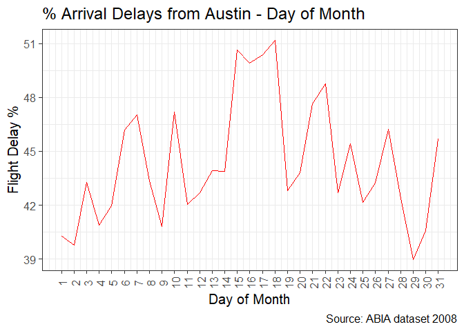<!-- -->

``` r
# BY DAY OF WEEK
ggplot(arrdel_dow) + 
  geom_line(aes(x=DayOfWeek, y=arrdel.prt), color='red') + 
  theme_bw(base_size=15) +
  scale_x_continuous(breaks = 1:7) +
  labs(title="% Departure Delays from Austin - Day of Week", 
       caption="Source: ABIA dataset 2008",
       y="Flight Delay %",
       x = "Day of Week")
```

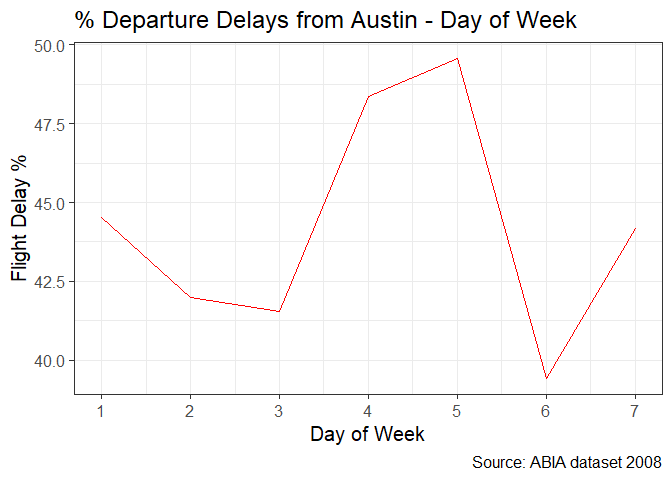<!-- -->

2)  What is the average amount of times by which flights in and out of
    Austin get delayed?

<!-- end list -->

``` r
#BY MONTH
p1 = ggplot(mean_depdel_month) + 
  geom_line(aes(x=Month, y=mean.del), color='blue') + 
  theme_bw(base_size=10) +
  scale_x_continuous(breaks = 1:12) +
  labs(title="Mean Departure Delays from Austin", 
       caption="Source: ABIA dataset 2008",
       y="Flight Delay Mean (mins)",
       x = "Month")

p2 = ggplot(mean_arrdel_month) + 
  geom_line(aes(x=Month, y=mean.del), color='red') + 
  theme_bw(base_size=10) +
  scale_x_continuous(breaks = 1:12) +
  labs(title="Mean Departure Delays from Austin", 
       caption="Source: ABIA dataset 2008",
       y="Flight Delay Mean (mins)",
       x = "Month")

grid.arrange(p1,p2, nrow=1)
```

    ## Warning: Removed 1 rows containing missing values (geom_path).
    
    ## Warning: Removed 1 rows containing missing values (geom_path).

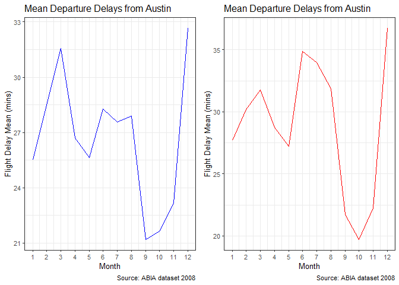<!-- -->

``` r
# BY DAY OF MONTH
p1 = ggplot(mean_depdel_dom) + 
  geom_line(aes(x=DayofMonth, y=mean.del), color='blue') + 
  theme_bw(base_size=10) +
  scale_x_continuous(breaks = 1:31) +
  labs(title="Mean Departure Delays from Austin", 
       caption="Source: ABIA dataset 2008",
       y="Flight Delay Mean (mins)",
       x = "Day of Month") +
  theme(axis.text.x = element_text(angle=90, vjust=0.6))

p2 = ggplot(mean_arrdel_dom) + 
  geom_line(aes(x=DayofMonth, y=mean.del), color='red') + 
  theme_bw(base_size=10) +
  scale_x_continuous(breaks = 1:31) +
  labs(title="Mean Arrival Delays from Austin", 
       caption="Source: ABIA dataset 2008",
       y="Flight Delay Mean (mins)",
       x = "Day of Month") +
  theme(axis.text.x = element_text(angle=90, vjust=0.6))

grid.arrange(p1,p2, nrow=1)
```

    ## Warning: Removed 1 rows containing missing values (geom_path).
    
    ## Warning: Removed 1 rows containing missing values (geom_path).

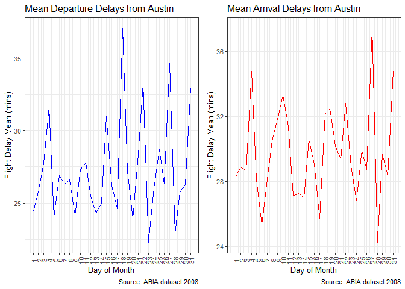<!-- -->

``` r
# BY DAY OF WEEK
p1 = ggplot(mean_depdel_dow) + 
  geom_line(aes(x=DayOfWeek, y=mean.del), color='blue') + 
  theme_bw(base_size=10) +
  scale_x_continuous(breaks = 1:31) +
  labs(title="Mean Departure Delays from Austin", 
       caption="Source: ABIA dataset 2008",
       y="Flight Delay Mean (mins)",
       x = "Day of Week") 


p2 = ggplot(mean_arrdel_dow) + 
  geom_line(aes(x=DayOfWeek, y=mean.del), color='red') + 
  theme_bw(base_size=10) +
  scale_x_continuous(breaks = 1:31) +
  labs(title="Mean Arrival Delays from Austin", 
       caption="Source: ABIA dataset 2008",
       y="Flight Delay Mean (mins)",
       x = "Day of Week") 


grid.arrange(p1,p2, nrow=1)
```

    ## Warning: Removed 1 rows containing missing values (geom_path).
    
    ## Warning: Removed 1 rows containing missing values (geom_path).

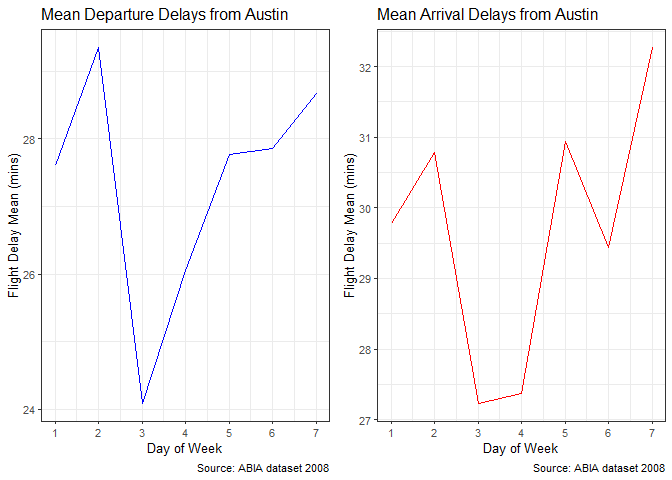<!-- -->

3)  What are the Origin(flights to Austin) and Destination(flights from
    Austin) with the most cancellation blues?
4)  How are these split by the Cancellation Codes?

<!-- end list -->

``` r
# BY ORIGIN
ggplot(orig_cancel, aes(x=Origin, y=tot.cancel)) + 
  geom_bar(stat='identity') +
  facet_wrap(~ CancellationCode, nrow = 3) +
  labs(title="Most Cancellations From ?", 
       caption="Source: ABIA dataset 2008",
       y="Total FLights Cancelled",
       x = "Origin Airport") +
  theme(axis.text.x = element_text(angle=90, vjust=0.6))
```

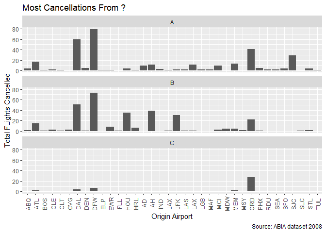<!-- -->

``` r
# BY DESTINATION
ggplot(dest_cancel, aes(x=Dest, y=tot.cancel)) + 
  geom_bar(stat='identity') +
  facet_wrap(~ CancellationCode, nrow = 3) +
  labs(title="Most Cancellations To ?", 
       caption="Source: ABIA dataset 2008",
       y="Total FLights Cancelled",
       x = "Destination Airport") +
  theme(axis.text.x = element_text(angle=90, vjust=0.6))
```

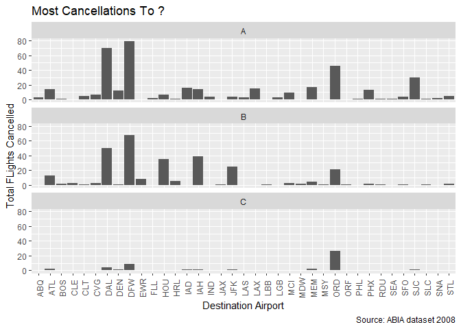<!-- -->

5)  What are the airline carriers one should expect most delays with?

<!-- end list -->

``` r
# CARRIER DELAYS
ggplot(na.omit(carrier_del), aes(x=UniqueCarrier, y=mean.del)) + 
  geom_bar(stat='identity') +
  labs(title="Which airline carriers to avoid?", 
       caption="Source: ABIA dataset 2008",
       y="Mean Delay Time",
       x = "Airline Carrier") +
  theme(axis.text.x = element_text(angle=90, vjust=0.6))
```

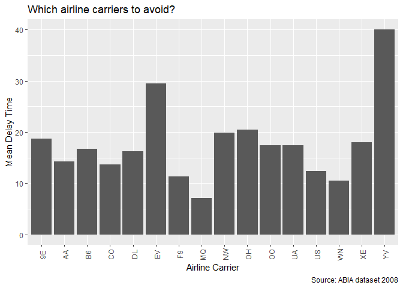<!-- -->

6)  Which are the best Origin/Dest to expect pre-time arrival/departures
    to/from Austin ?

<!-- end list -->

``` r
p1 = ggplot(pre_dep, aes(x=Origin , y=cnt.dep)) + 
  geom_bar(stat='identity') +
  labs(title="BEST airports to fly FROM, to Austin?", 
       caption="Source: ABIA dataset 2008",
       y="Total Pre Time Departures",
       x = "Airport") +
  theme(axis.text.x = element_text(angle=90, vjust=0.6))

p2 = ggplot(pre_arr, aes(x=Dest , y=cnt.arr)) + 
  geom_bar(stat='identity') +
  labs(title="BEST airports to fly TO, from Austin?", 
       caption="Source: ABIA dataset 2008",
       y="Total Pre Time Arrivals",
       x = "Airport") +
  theme(axis.text.x = element_text(angle=90, vjust=0.6))

grid.arrange(p1,p2, nrow=2)
```

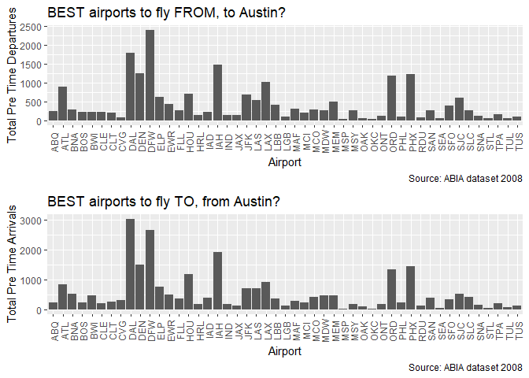<!-- -->

7)  Which airports do I expect to spend the maximum time Taxing In and
    Out?

<!-- end list -->

``` r
p1 = ggplot(taxi_out, aes(x=Origin , y=mean)) + 
  geom_bar(stat='identity') +
  labs(title="Average Taxi Out times", 
       caption="Source: ABIA dataset 2008",
       y="Average time (mins)",
       x = "Airport") +
  theme(axis.text.x = element_text(angle=90, vjust=0.6))

p2 = ggplot(taxi_in, aes(x=Dest , y=mean)) + 
  geom_bar(stat='identity') +
  labs(title="Average Taxi In times", 
       caption="Source: ABIA dataset 2008",
       y="Average time (mins)",
       x = "Airport") +
  theme(axis.text.x = element_text(angle=90, vjust=0.6))

grid.arrange(p1,p2, nrow=2)
```

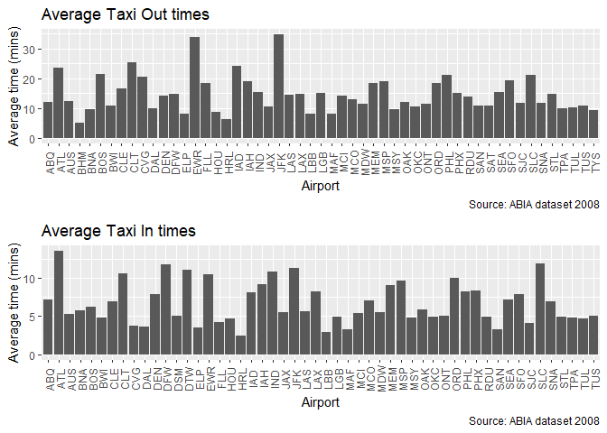<!-- -->

8)  What are the times of the day I should expect the maximum arrival
    and departure delays in/out of Austin?

<!-- end list -->

``` r
p1 = ggplot(period_dep_del, aes(x=Period_dep , y=mean.del)) + 
  geom_bar(stat='identity') +
  labs(title="Best time to fly out of Austin?", 
       caption="Source: ABIA dataset 2008",
       y="Average Dep Delay",
       x = "Time Of Day") 

p2 = ggplot(period_arr_del, aes(x=Period_arr , y=mean.del)) + 
  geom_bar(stat='identity') +
  labs(title="Best time to fly into Austin?", 
       caption="Source: ABIA dataset 2008",
       y="Average Arrival Delay",
       x = "Time Of Day") 

grid.arrange(p1,p2, nrow=1)
```

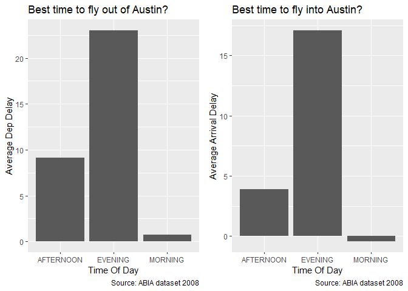<!-- -->

9)  Are these trends better/worse on some days of the week? Whether I
    could beat this?

<!-- end list -->

``` r
ggplot(period_dep_del_dow, aes(x=DayOfWeek, y=mean.del)) + 
  geom_bar(stat='identity') +
  facet_wrap(~ Period_dep, nrow = 7) +
  labs(title="Best time to fly out of Austin?", 
       caption="Source: ABIA dataset 2008",
       y="Average Dep Delay",
       x = "Day of Week") +
  theme(axis.text.x = element_text(angle=90, vjust=0.6))
```

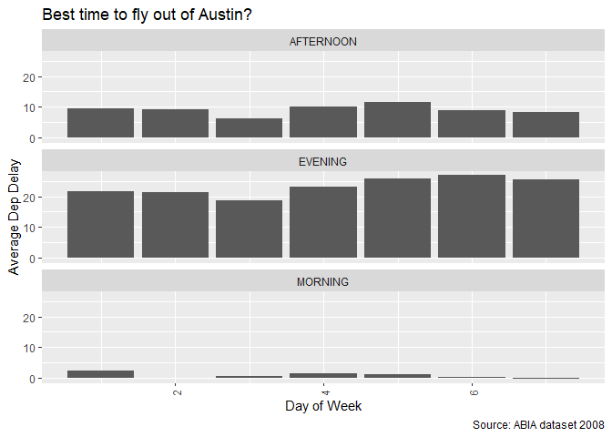<!-- -->

``` r
ggplot(period_arr_del_dow, aes(x=DayOfWeek, y=mean.del)) + 
  geom_bar(stat='identity') +
  facet_wrap(~ Period_arr, nrow = 7) +
  labs(title="Best time to fly into Austin?", 
       caption="Source: ABIA dataset 2008",
       y="Average Arr Delay",
       x = "Day of Week") +
  theme(axis.text.x = element_text(angle=90, vjust=0.6))
```

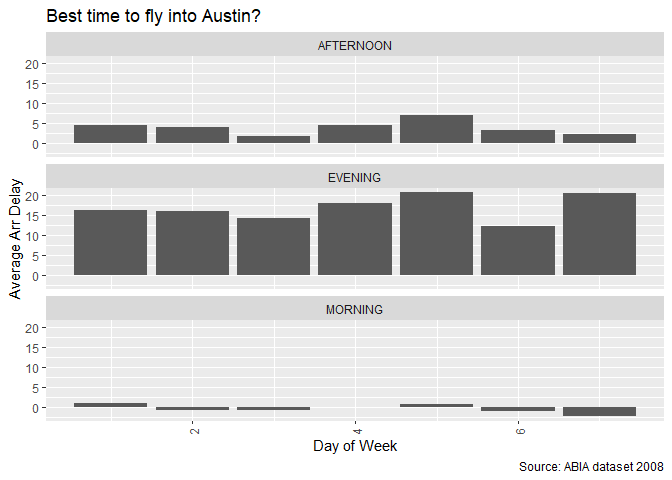<!-- -->

PORTFOLIO MODELLING

PORTFOLIO 1

My Portfolio 1 consists of EFT’s that have more of a global outlook like
-

1)VT - global reach ETF 2)ACWX - has a global reach minus the United
States 3)FXI - China focussed ETF

``` r
#PORTFOLIO 1
mystocks = c("VT", "ACWX", "FXI")
myprices = getSymbols(mystocks, from = "2014-01-01")
```

    ## 'getSymbols' currently uses auto.assign=TRUE by default, but will
    ## use auto.assign=FALSE in 0.5-0. You will still be able to use
    ## 'loadSymbols' to automatically load data. getOption("getSymbols.env")
    ## and getOption("getSymbols.auto.assign") will still be checked for
    ## alternate defaults.
    ## 
    ## This message is shown once per session and may be disabled by setting 
    ## options("getSymbols.warning4.0"=FALSE). See ?getSymbols for details.

``` r
#Adjusting for splits and dividends
for(ticker in mystocks) {
  expr = paste0(ticker, "a = adjustOHLC(", ticker, ")")
  eval(parse(text=expr))
}

#Combining all returns in a matrix
all_returns = cbind(ClCl(ACWXa),ClCl(FXIa),ClCl(VTa))
all_returns = as.matrix(na.omit(all_returns))


#Simulating different possible scenarios by bootstrap for PORTFOLIO 1

initial_wealth = 100000
sim1= foreach(i=1:5000, .combine='rbind') %do% {
  total_wealth = initial_wealth
  weights = c(0.33, 0.33, 0.33) #
  holdings = weights * total_wealth
  n_days = 20
  wealthtracker = rep(0, n_days)
  for(today in 1:n_days) {
    return.today = resample(all_returns, 1, orig.ids=FALSE)
    holdings = holdings + holdings*return.today
    total_wealth = sum(holdings)
    wealthtracker[today] = total_wealth
  }
  wealthtracker
}

# VAR Calculation
var = quantile(wealthtracker,c(0.05))
cat("The VAR for this portfolio is ", var)
```

    ## The VAR for this portfolio is  100829.8

PORTFOLIO 2 My portfolio 2 is a safe retirement centric ETF portfolio.
Long time hold with guaranteed yields.

1)  VYM - retirement centric high dividend yield
2)  VGLT - safe ETF with returns on long term
3)  BOND - 3.4% safe yield return
4)  PGX - 5.7% safe dividend returns, risk averse

<!-- end list -->

``` r
#PORTFOLIO 2
mystocks2 = c("VYM", "VGLT", "BOND" , "PGX")
myprices2 = getSymbols(mystocks2, from = "2014-01-01")

#Adjusting for splits and dividends
for(ticker in mystocks2) {
  expr = paste0(ticker, "a = adjustOHLC(", ticker, ")")
  eval(parse(text=expr))
}

#Combining all returns in a matrix
all_returns2 = cbind(ClCl(VYMa),ClCl(VGLTa),ClCl(BONDa),ClCl(PGXa))
all_returns2 = as.matrix(na.omit(all_returns2))


#Simulating different possible scenarios by bootstrap for PORTFOLIO 2

initial_wealth = 100000
sim2= foreach(i=1:5000, .combine='rbind') %do% {
  total_wealth = initial_wealth
  weights = c(0.25, 0.25, 0.25, 0.25) #
  holdings = weights * total_wealth
  n_days = 20
  wealthtracker = rep(0, n_days)
  for(today in 1:n_days) {
    return.today = resample(all_returns2, 1, orig.ids=FALSE)
    holdings = holdings + holdings*return.today
    total_wealth = sum(holdings)
    wealthtracker[today] = total_wealth
  }
  wealthtracker
}

#CALCULATING VAR
var = quantile(wealthtracker,c(0.05))
cat("The VAR for this portfolio is ", var)
```

    ## The VAR for this portfolio is  99968.87

PORTFOLIO 3 My portfolio 3 is a diverse mix porfolio. High risk centric
but higher returns on success too. 1) VGT - is a tech based ETF with
some shares on Amazon too 2) XLY - is a big $12 Billion consumer fund 3)
XBI - is a high risk ETF with money in a lot of medical startups 4) VNQ
- is a real estate based ETF

``` r
#PORTFOLIO 3
mystocks3 = c("VGT", "XLY", "XBI" , "VNQ")
myprices3 = getSymbols(mystocks3, from = "2014-01-01")

#Adjusting for splits and dividends
for(ticker in mystocks3) {
  expr = paste0(ticker, "a = adjustOHLC(", ticker, ")")
  eval(parse(text=expr))
}

#Combining all returns in a matrix
all_returns3 = cbind(ClCl(VGTa),ClCl(XLYa),ClCl(XBIa),ClCl(VNQa))
all_returns3 = as.matrix(na.omit(all_returns3))


#Simulating different possible scenarios by bootstrap for PORTFOLIO 2

initial_wealth = 100000
sim3= foreach(i=1:5000, .combine='rbind') %do% {
  total_wealth = initial_wealth
  weights = c(0.25, 0.25, 0.25, 0.25) #
  holdings = weights * total_wealth
  n_days = 20
  wealthtracker = rep(0, n_days)
  for(today in 1:n_days) {
    return.today = resample(all_returns3, 1, orig.ids=FALSE)
    holdings = holdings + holdings*return.today
    total_wealth = sum(holdings)
    wealthtracker[today] = total_wealth
  }
  wealthtracker
}

#CALCULATING VAR
var = quantile(wealthtracker,c(0.05))
cat("The VAR for this portfolio is ", var)
```

    ## The VAR for this portfolio is  101092.2

## Including Plots

You can also embed plots, for example:

<!-- -->

Note that the `echo = FALSE` parameter was added to the code chunk to
prevent printing of the R code that generated the plot.
