STA Assignment
================

## Q1 Visual story telling part 1: green buildings

I disagree with the on-staff stats guru on some points mentioned
below:  
Which Cluster is the location in:  
The excel guru looks at the rent of the whole market and fails to
consider cluster in the whole economic calculation. Each cluster has a
different rent spectrum. Moreover, the green building in each cluster
has a different trend of market rate as compared to the non-green
buildings in the same cluster. In some clusters, green buildings are
less expensive than the others and in others the difference is very
different from others. So $2.6 more per squarefoot is a vague estimate.
It can easily be more or less depending on the cluster.
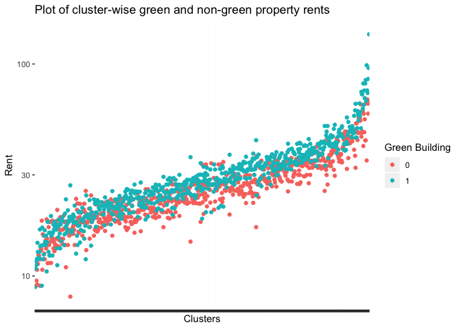<!-- -->
Can we assume minimum occupancy rate of 90%?  
Half of the properties have below 90% occupancy rate. Though green
properties are more occupied than non-green but still 90% is a very
large assumption on part of the stats-guru. Moreover, some clusters
don’t have that much occupancy, which can mean that there is not much
demand in those clusters ruling out the idea of investing in those
clusters.

    ##    Min. 1st Qu.  Median    Mean 3rd Qu.    Max. 
    ##    0.00   77.85   89.53   82.61   96.44  100.00

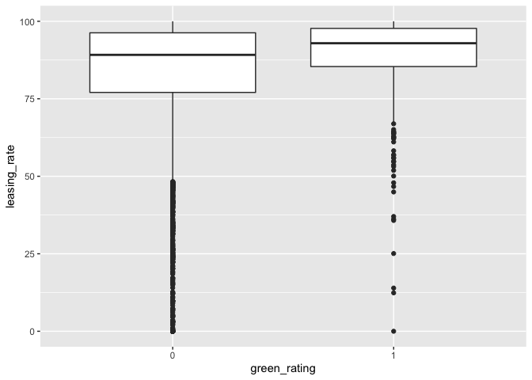<!-- -->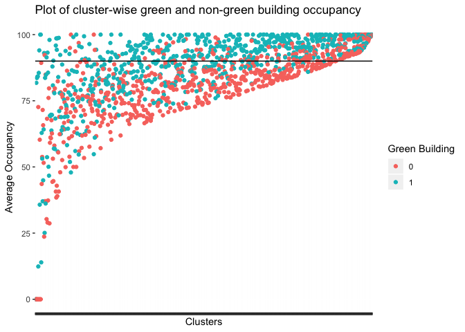<!-- -->
Who pays the utility bills?  
The stats-guru does not take into account whether the utility bills are
paid by renter or not. Rents are obviously higher for utility cost
included in rent. There seem to be both green and non-green buildings in
the two categories. We need to account for utility charges if either
case is there.
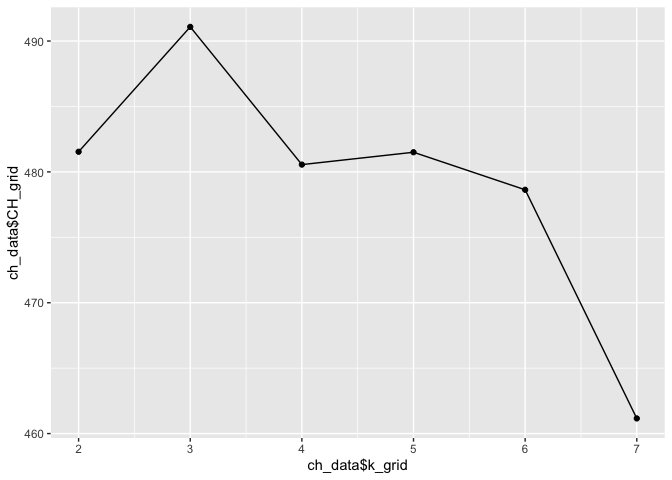<!-- -->
Electricity cost and Gas costs  
Both Electricity and Gas costs are different for different clusters.
<!-- -->

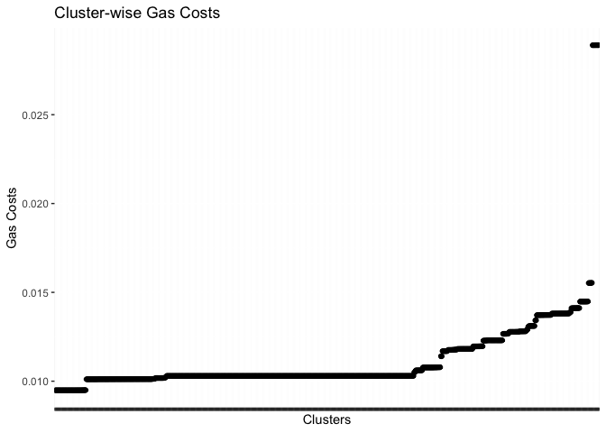<!-- --> Do
all clusters have equally tall buildings?  
Each cluster has a different range of stories of a building. As a trend,
green buildings are usually taller cluster-wise. The trend in the story
reflects the demand in the area and there also might be additional legal
restrictions in some areas as well.
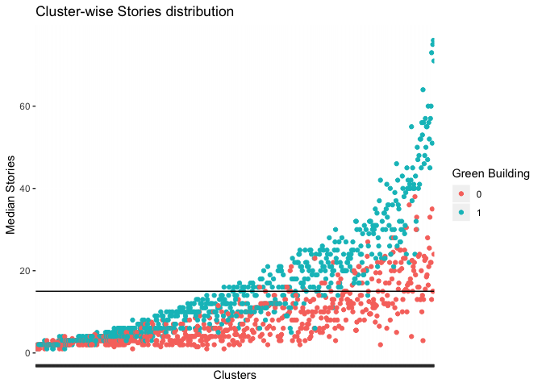<!-- -->
CONCLUSION  
\-The recommendation put forward by the stats guru seems pretty vague
and incomplete. He fails to consider factors which might have an
economic impact both positively and negatively.  
\-He did not consider the cluster-wise distribution of rents and then
the difference of green and non-green property’s rent.  
\-His assumption of atleast 90% occupancy seems vague.  
\-He does not account utility costs nor does he consider whether it is
included in the rent or not.  
\-All clusters do not have high sky scrapers. One hypothesis is that it
can indicate demand or legal restrictions.

\#Q2 VISUAL STROY TELLING - FLIGHTS AT ABIA

We are going to take a look at the ABIA data from the eyes and interest
of a frequent flyer staying in Austin. As a frequent flyer I would want
to know -

1)  What percentage of flights in and out of Austin are delayed ?
2)  What is the average amount of times by which flights in and out of
    Austin get delayed?
3)  What are the Origin(flights to Austin) and Destination(flights from
    Austin) with the most cancellation blues?
4)  What causes these cancellations ?
5)  What are the airline carriers one should expect most delays with?
6)  Which are the best Origin/Dest to expect pre-time arrival/departures
    to/from Austin ?
7)  Which airports do I expect to spend the maximum time Taxing In and
    Out?
8)  What are the times of the day I should expect the maximum arrival
    and departure delays in/out of Austin?
9)  Are these trends better/worse on some days of the week? Whether I
    could beat this?

But first, PIPING GROUPING AND SUMMARISING the data.

1)  What percentage of flights in and out of Austin are delayed ?

DEPARTURES
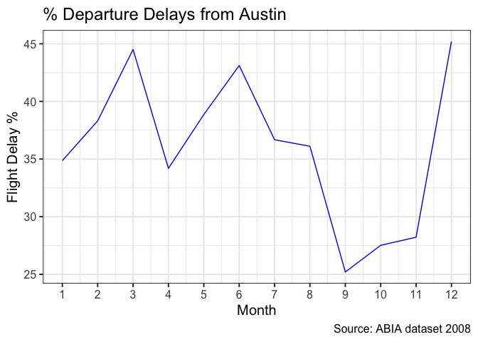<!-- -->

<!-- -->

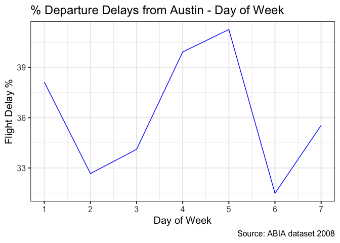<!-- -->

ARRIVALS
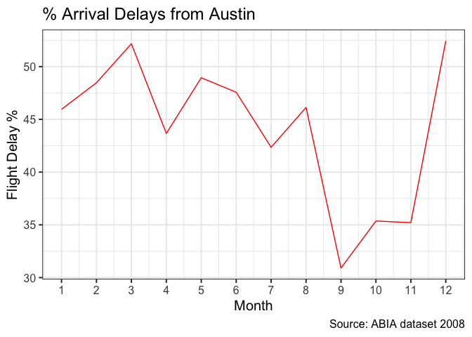<!-- -->

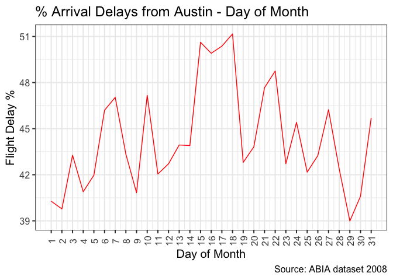<!-- -->

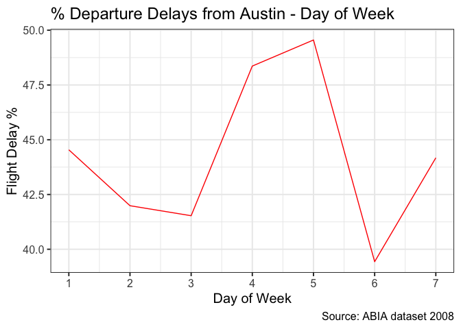<!-- -->

2)  What is the average amount of times by which flights in and out of
    Austin get delayed?

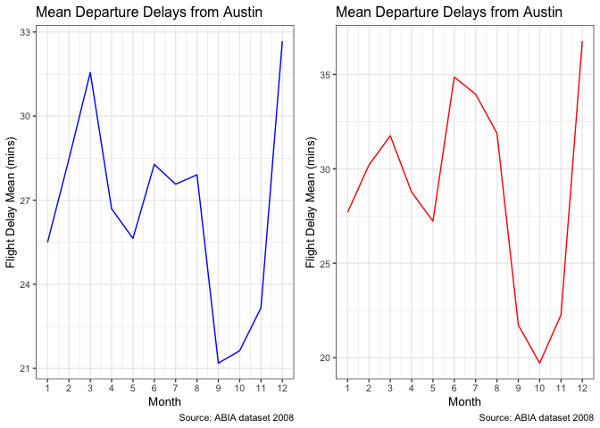<!-- -->

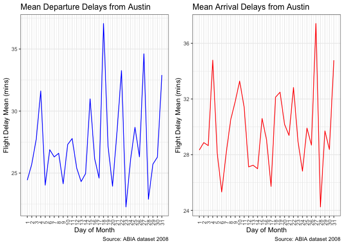<!-- -->

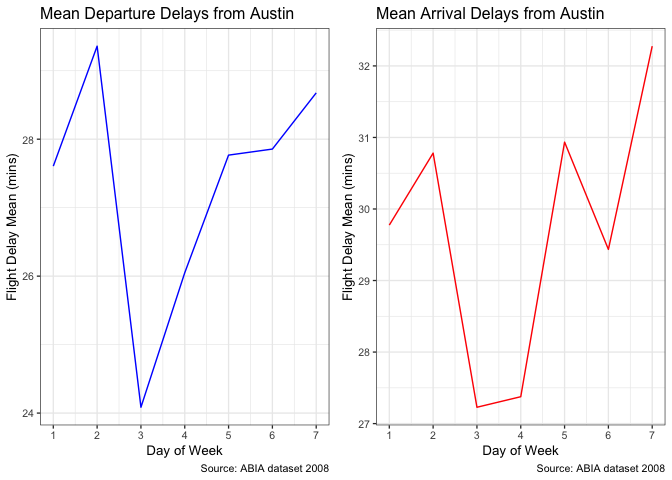<!-- -->

3)  What are the Origin(flights to Austin) and Destination(flights from
    Austin) with the most cancellation blues?

4)  How are these split by the Cancellation Codes?
    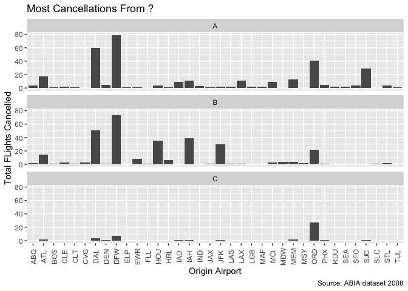<!-- -->
    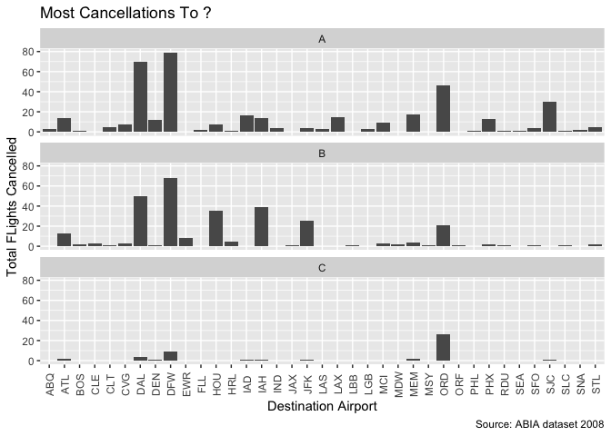<!-- -->

5)  What are the airline carriers one should expect most delays with?

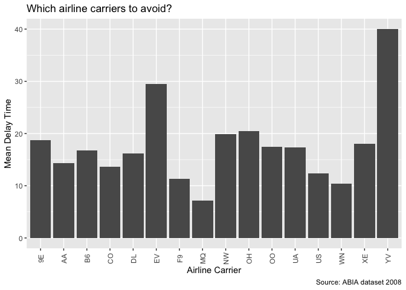<!-- -->

6)  Which are the best Origin/Dest to expect pre-time arrival/departures
    to/from Austin ?

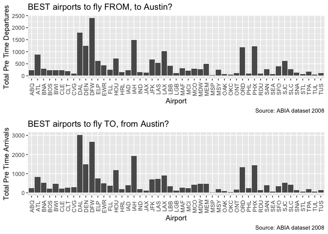<!-- -->

7)  Which airports do I expect to spend the maximum time Taxing In and
    Out?
    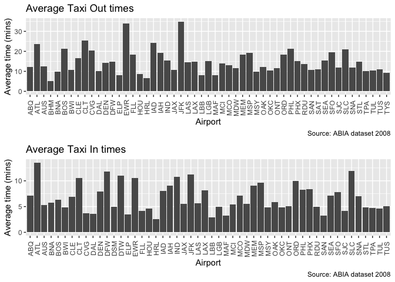<!-- -->

8)  What are the times of the day I should expect the maximum arrival
    and departure delays in/out of Austin?
    <!-- -->

9)  Are these trends better/worse on some days of the week? Whether I
    could beat this?
    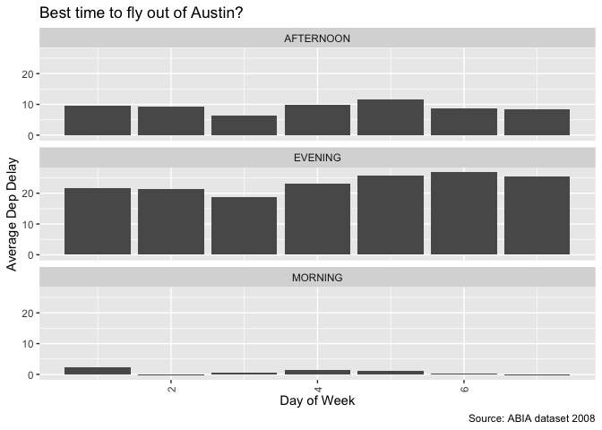<!-- -->

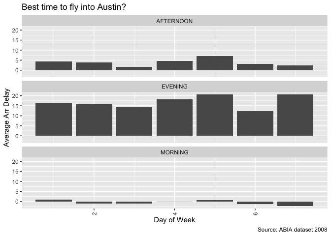<!-- -->

\#Q3 PORTFOLIO MODELLING

PORTFOLIO 1. My Portfolio 1 consists of EFT’s that have more of a global
outlook like.

1.  VT - global reach ETF
2.  ACWX - has a global reach minus the United States
3.  FXI - China focussed ETF

<!-- end list -->

    ## The VAR for this portfolio is  98985.21

PORTFOLIO 2. My portfolio 2 is a safe retirement centric ETF portfolio.
Long time hold with guaranteed yields.

1)  VYM - retirement centric high dividend yield
2)  VGLT - safe ETF with returns on long term
3)  BOND - 3.4% safe yield return
4)  PGX - 5.7% safe dividend returns, risk averse

<!-- end list -->

    ## The VAR for this portfolio is  99594.29

PORTFOLIO 3. My portfolio 3 is a diverse mix porfolio. High risk centric
but higher returns on success too.

1)  VGT - is a tech based ETF with some shares on Amazon too
2)  XLY - is a big $12 Billion consumer fund
3)  XBI - is a high risk ETF with money in a lot of medical startups
4)  VNQ - is a real estate based ETF

<!-- end list -->

    ## The VAR for this portfolio is  91944.63

## Q5 Market segmentation

Consider the data in social\_marketing.csv. This was data collected in
the course of a market-research study using followers of the Twitter
account of a large consumer brand that shall remain nameless—let’s call
it “NutrientH20” just to have a label. The goal here was for NutrientH20
to understand its social-media audience a little bit better, so that it
could hone its messaging a little more sharply.

A bit of background on the data collection: the advertising firm who
runs NutrientH20’s online-advertising campaigns took a sample of the
brand’s Twitter followers. They collected every Twitter post (“tweet”)
by each of those followers over a seven-day period in June 2014. Every
post was examined by a human annotator contracted through Amazon’s
Mechanical Turk service. Each tweet was categorized based on its content
using a pre-specified scheme of 36 different categories, each
representing a broad area of interest (e.g. politics, sports, family,
etc.) Annotators were allowed to classify a post as belonging to more
than one category. For example, a hypothetical post such as “I’m really
excited to see grandpa go wreck shop in his geriatic soccer league this
Sunday\!” might be categorized as both “family” and “sports.” You get
the picture.

Each row of social\_marketing.csv represents one user, labeled by a
random (anonymous, unique) 9-digit alphanumeric code. Each column
represents an interest, which are labeled along the top of the data
file. The entries are the number of posts by a given user that fell into
the given category. Two interests of note here are “spam”
(i.e. unsolicited advertising) and “adult” (posts that are
pornographic, salacious, or explicitly sexual). There are a lot of spam
and pornography “bots” on Twitter; while these have been filtered out of
the data set to some extent, there will certainly be some that slip
through. There’s also an “uncategorized” label. Annotators were told to
use this sparingly, but it’s there to capture posts that don’t fit at
all into any of the listed interest categories. (A lot of annotators may
used the “chatter” category for this as well.) Keep in mind as you
examine the data that you cannot expect perfect annotations of all
posts. Some annotators might have simply been asleep at the wheel some,
or even all, of the time\! Thus there is some inevitable error and
noisiness in the annotation process.

Your task to is analyze this data as you see fit, and to prepare a
concise report for NutrientH20 that identifies any interesting market
segments that appear to stand out in their social-media audience. You
have complete freedom in deciding how to pre-process the data and how to
define “market segment.” (Is it a group of correlated interests? A
cluster? A latent factor? Etc.) Just use the data to come up with some
interesting, well-supported insights about the audience, and be clear
about what you did.

## Analysis:

Step 1: Data loading and exploration

You can include R code in the document as
    follows:

    ##     chatter        current_events        travel        photo_sharing    
    ##  Min.   :-1.3328   Min.   :-0.9926   Min.   :-0.8266   Min.   :-1.0910  
    ##  1st Qu.:-0.7621   1st Qu.:-0.6804   1st Qu.:-0.8266   1st Qu.:-0.7585  
    ##  Median :-0.2199   Median :-0.2193   Median :-0.2779   Median :-0.2104  
    ##  Mean   : 0.0000   Mean   : 0.0000   Mean   : 0.0000   Mean   : 0.0000  
    ##  3rd Qu.: 0.5673   3rd Qu.: 0.3929   3rd Qu.: 0.3446   3rd Qu.: 0.5381  
    ##  Max.   : 6.0866   Max.   : 7.8745   Max.   : 9.3242   Max.   : 6.4281  
    ##  uncategorized        tv_film        sports_fandom        politics      
    ##  Min.   :-0.7457   Min.   :-0.6698   Min.   :-0.8210   Min.   :-0.6996  
    ##  1st Qu.:-0.7457   1st Qu.:-0.6698   1st Qu.:-0.8210   1st Qu.:-0.6996  
    ##  Median :-0.2472   Median :-0.3603   Median :-0.2988   Median :-0.3640  
    ##  Mean   : 0.0000   Mean   : 0.0000   Mean   : 0.0000   Mean   : 0.0000  
    ##  3rd Qu.: 0.4115   3rd Qu.: 0.3028   3rd Qu.: 0.4384   3rd Qu.: 0.2873  
    ##  Max.   :11.4045   Max.   : 9.0381   Max.   : 7.7431   Max.   : 6.1638  
    ##       food             family        home_and_garden       music        
    ##  Min.   :-0.8476   Min.   :-0.7251   Min.   :-0.6211   Min.   :-0.6334  
    ##  1st Qu.:-0.8476   1st Qu.:-0.7251   1st Qu.:-0.6211   1st Qu.:-0.6334  
    ##  Median :-0.2450   Median :-0.3236   Median :-0.6211   Median :-0.6334  
    ##  Mean   : 0.0000   Mean   : 0.0000   Mean   : 0.0000   Mean   : 0.0000  
    ##  3rd Qu.: 0.4701   3rd Qu.: 0.4511   3rd Qu.: 0.4318   3rd Qu.: 0.3817  
    ##  Max.   : 7.7907   Max.   :11.7712   Max.   : 9.7835   Max.   :10.3297  
    ##       news         online_gaming         shopping       health_nutrition 
    ##  Min.   :-0.6036   Min.   :-0.51409   Min.   :-0.7878   Min.   :-0.6448  
    ##  1st Qu.:-0.6036   1st Qu.:-0.51409   1st Qu.:-0.7878   1st Qu.:-0.6448  
    ##  Median :-0.6036   Median :-0.51409   Median :-0.3061   Median :-0.4776  
    ##  Mean   : 0.0000   Mean   : 0.00000   Mean   : 0.0000   Mean   : 0.0000  
    ##  3rd Qu.: 0.2192   3rd Qu.: 0.07592   3rd Qu.: 0.4292   3rd Qu.: 0.2553  
    ##  Max.   : 9.0222   Max.   : 7.87723   Max.   : 6.5695   Max.   : 5.2058  
    ##   college_uni      sports_playing       cooking             eco        
    ##  Min.   :-0.6082   Min.   :-0.6405   Min.   :-0.6827   Min.   :-0.604  
    ##  1st Qu.:-0.6082   1st Qu.:-0.6405   1st Qu.:-0.6827   1st Qu.:-0.604  
    ##  Median :-0.3976   Median :-0.6405   Median :-0.3446   Median :-0.604  
    ##  Mean   : 0.0000   Mean   : 0.0000   Mean   : 0.0000   Mean   : 0.000  
    ##  3rd Qu.: 0.1425   3rd Qu.: 0.4343   3rd Qu.: 0.2425   3rd Qu.: 0.443  
    ##  Max.   : 6.5019   Max.   : 9.5705   Max.   : 5.6678   Max.   :11.174  
    ##    computers          business          outdoors           crafts       
    ##  Min.   :-0.5783   Min.   :-0.5488   Min.   :-0.6638   Min.   :-0.5978  
    ##  1st Qu.:-0.5783   1st Qu.:-0.5488   1st Qu.:-0.6638   1st Qu.:-0.5978  
    ##  Median :-0.5783   Median :-0.5488   Median :-0.6638   Median :-0.5978  
    ##  Mean   : 0.0000   Mean   : 0.0000   Mean   : 0.0000   Mean   : 0.0000  
    ##  3rd Qu.: 0.3388   3rd Qu.: 0.3831   3rd Qu.: 0.4401   3rd Qu.: 0.4168  
    ##  Max.   :11.9547   Max.   : 9.7018   Max.   : 8.5817   Max.   : 7.3710  
    ##    automotive           art              religion           beauty       
    ##  Min.   :-0.6238   Min.   :-0.46654   Min.   :-0.6257   Min.   :-0.5690  
    ##  1st Qu.:-0.6238   1st Qu.:-0.46654   1st Qu.:-0.6257   1st Qu.:-0.5690  
    ##  Median :-0.6238   Median :-0.46654   Median :-0.6257   Median :-0.5690  
    ##  Mean   : 0.0000   Mean   : 0.00000   Mean   : 0.0000   Mean   : 0.0000  
    ##  3rd Qu.: 0.3444   3rd Qu.: 0.09704   3rd Qu.: 0.2942   3rd Qu.: 0.3125  
    ##  Max.   : 9.7039   Max.   : 9.67793   Max.   : 7.5082   Max.   : 9.7571  
    ##    parenting           dating            school        personal_fitness 
    ##  Min.   :-0.6532   Min.   :-0.4313   Min.   :-0.6495   Min.   :-0.6627  
    ##  1st Qu.:-0.6532   1st Qu.:-0.4313   1st Qu.:-0.6495   1st Qu.:-0.6627  
    ##  Median :-0.6532   Median :-0.4313   Median :-0.6495   Median :-0.6627  
    ##  Mean   : 0.0000   Mean   : 0.0000   Mean   : 0.0000   Mean   : 0.0000  
    ##  3rd Qu.: 0.3620   3rd Qu.: 0.0856   3rd Qu.: 0.4307   3rd Qu.: 0.2873  
    ##  Max.   : 7.4163   Max.   : 8.9182   Max.   :11.5931   Max.   : 7.1080  
    ##     fashion        small_business         spam              adult       
    ##  Min.   :-0.6016   Min.   :-0.4888   Min.   :-0.06773   Min.   :-0.227  
    ##  1st Qu.:-0.6016   1st Qu.:-0.4888   1st Qu.:-0.06773   1st Qu.:-0.227  
    ##  Median :-0.6016   Median :-0.4888   Median :-0.06773   Median :-0.227  
    ##  Mean   : 0.0000   Mean   : 0.0000   Mean   : 0.00000   Mean   : 0.000  
    ##  3rd Qu.: 0.2955   3rd Qu.: 0.2557   3rd Qu.:-0.06773   3rd Qu.:-0.227  
    ##  Max.   : 8.6689   Max.   :11.7953   Max.   :32.08329   Max.   :11.569

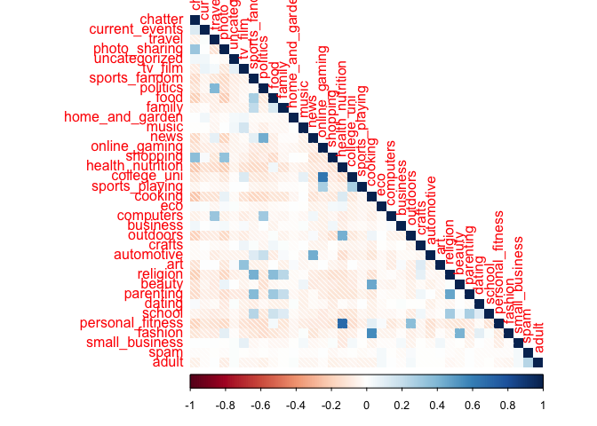<!-- -->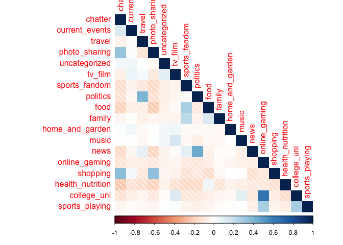<!-- -->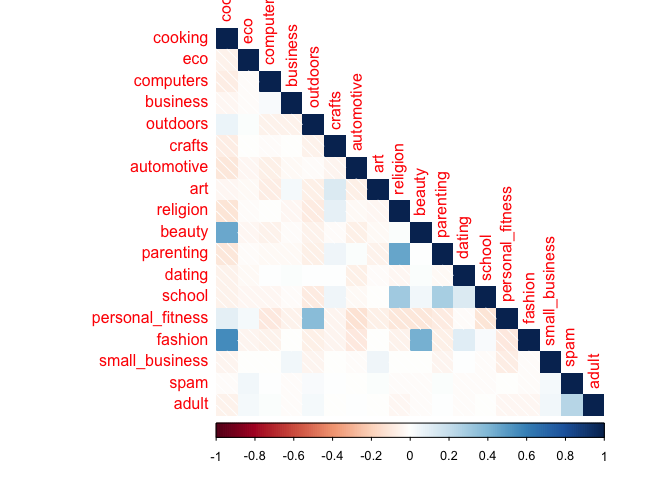<!-- -->
Few insights - \* Categories like fashion, beauty, dating etc are
correlated, similarly for . \* Categories like spam, adult are also
correlated

  - Categories such as spam, adult have high range but the values till
    3rd quartile are very low. For example in spam, 3rd quartile is
    -0.067 and maximum value is 32

To decide how many clusters exist in our data, let’s look at Elbow and
Silhouette plots to explore further.

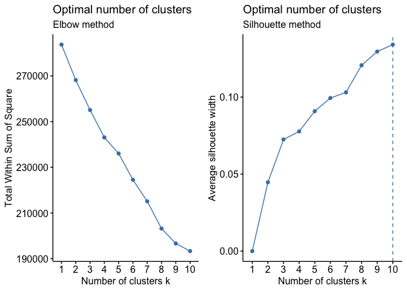<!-- -->

There is no elbow formation in the elbow plot. The silhouette plot is
also not able to decide upon a rational number of clusters for the
segment. 10 clusters in the data is too high to design a targeted
marketing strategy for the custome segments.

Let’s explore how 3,4,5 and 6 clusters look like.

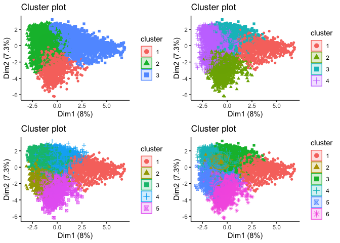<!-- -->

    ##   cluster Total.withinss betweenss
    ## 1       3       253144.8  30571.22
    ## 2       4       239827.6  43888.35
    ## 3       5       229105.6  54610.43
    ## 4       6       217597.7  66118.28
    ## 5       7       209949.0  73767.03

Clusters 5 and 6 are convoluted, having 3 and 4 clusters make more sense
for our business problem.

Let’s look at the CH index for clusters 3 to 7.

<!-- -->

Maximum value of CH index is 3 and there is a drop in CH value if number
of clusters is increased.

From the plot of clusters across PC 1 and 2, cluster 3 values look more
distinct in the principal component space.

Let’s explore what these principle comonents are actually made of
    -

    ## [1] "PC1 head"

    ##  [1] "religion"      "sports_fandom" "parenting"     "food"         
    ##  [5] "school"        "family"        "news"          "automotive"   
    ##  [9] "crafts"        "politics"

    ## [1] "PC1 tail"

    ##  [1] "personal_fitness" "health_nutrition" "online_gaming"   
    ##  [4] "uncategorized"    "college_uni"      "fashion"         
    ##  [7] "cooking"          "shopping"         "chatter"         
    ## [10] "photo_sharing"

    ## [1] "PC2 head"

    ##  [1] "chatter"        "politics"       "travel"         "shopping"      
    ##  [5] "automotive"     "current_events" "photo_sharing"  "news"          
    ##  [9] "computers"      "tv_film"

    ## [1] "PC2 tail"

    ##  [1] "religion"         "eco"              "dating"          
    ##  [4] "food"             "beauty"           "fashion"         
    ##  [7] "cooking"          "outdoors"         "personal_fitness"
    ## [10] "health_nutrition"

Cluster Profiling:

After looking at the top and bottom of first 2 principal components, we
can see there is group of people who are fitness enthisiasts and are
tweeting more about health, nutrition, food, cooking etc - Let’s call
them “Health Enthusiasts”

Similarly, there is another set of people who are more into talking
about politics, news, current events, parenting, businesss etc - Let’s
call them “Elderly”

And finaly, a third set of people who are into fashion, tv, films,
music, college and university etc - Let’s call them “Youth”

I have created macro categories by clubbing similar categories of tweets
based on the identifiction of interest areas for our 3 clusters. For
example health enthusiasts have all the health, fitness, food and
cooking replated tweets clubbed together and similalry for other
categories.

Cataegories such as adult, spam, uncategorized into others and are not
considered in creation of these macro categories of tweets.

Let’s look at the mean for these mcro categories by cluster -

    ## # A tibble: 3 x 4
    ##   cluster_final.cluster health.enthusiasts elderly youth
    ##                   <int>              <dbl>   <dbl> <dbl>
    ## 1                     1              18.9     8.49  16.4
    ## 2                     2               5.17   10.8   16.8
    ## 3                     3              12.5    15.6   14.5

Clearly, cluster 1 belongs to the “Health enthusiasts”, cluster 3 is the
group of “Elderly” and “Youth” is cluster 2.

Density plots shown below shows how the distribution of the points for
these macro categories across 3 clusters
-

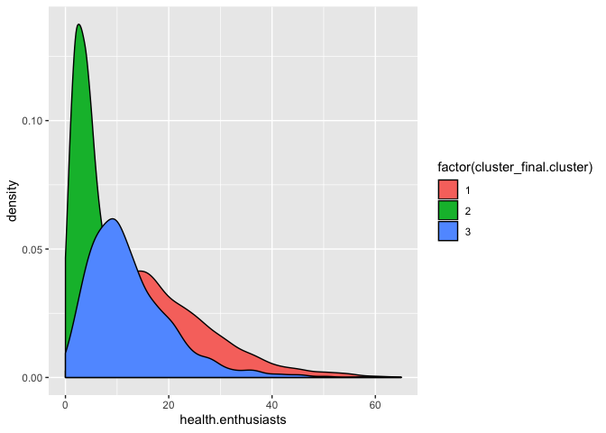<!-- -->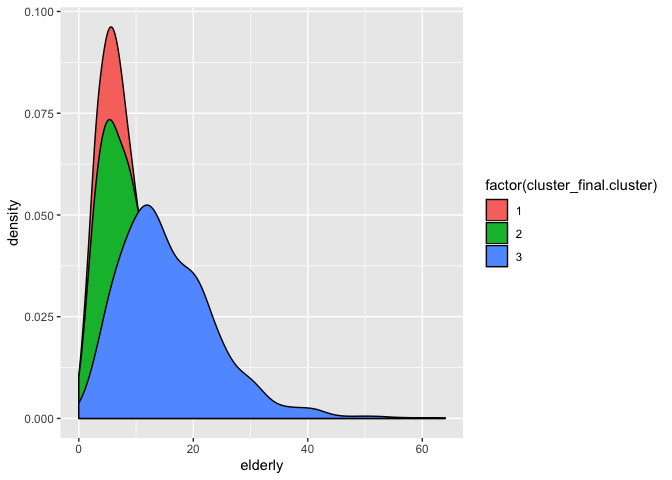<!-- -->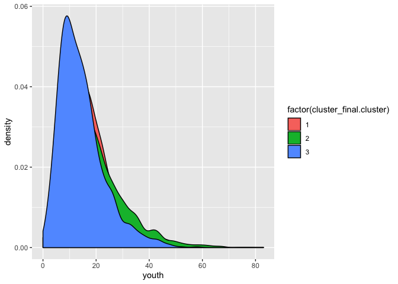<!-- -->

## Q6 Association rule mining

Use the data on grocery purchases in groceries.txt and find some
interesting association rules for these shopping baskets. Pick your own
thresholds for lift and confidence; just be clear what these thresholds
are and how you picked them. Do your discovered item sets make sense?
Present your discoveries in an interesting and concise way.

Notes:

Like with the first set of exercises: this is an exercise in visual and
numerical story-telling. Do be clear in your description of what you’ve
done, but keep the focus on the data, the figures, and the insights your
analysis has drawn from the data. The data file is a list of baskets:
one row per basket, with multiple items per row separated by commas.
You’ll have to cobble together a few utilities for processing this
into the format expected by the “arules” package. (This is not
intrinsically all that hard, but it is the kind of wrinkle you’ll
encounter frequently on real problems, where your software package
expects data in one format and the data comes in a different format.
Figuring out how to bridge that gap is part of the assignment, and so we
won’t be giving tips on this front.)

This is a dataset on Groceries with 9835 rows and 169 columns. Each row
corressponds to a transaction of grocery items added to cart. The
dataset is read as transactions with a delimiter of commas, so that the
format is compatible with arules package.The plot shows the most
frequently purchased grocery items as whole milk, other vegetables,
rolls/buns etc.

    ## [1] 9835  169

    ## transactions as itemMatrix in sparse format with
    ##  9835 rows (elements/itemsets/transactions) and
    ##  169 columns (items) and a density of 0.02609146 
    ## 
    ## most frequent items:
    ##       whole milk other vegetables       rolls/buns             soda 
    ##             2513             1903             1809             1715 
    ##           yogurt          (Other) 
    ##             1372            34055 
    ## 
    ## element (itemset/transaction) length distribution:
    ## sizes
    ##    1    2    3    4    5    6    7    8    9   10   11   12   13   14   15 
    ## 2159 1643 1299 1005  855  645  545  438  350  246  182  117   78   77   55 
    ##   16   17   18   19   20   21   22   23   24   26   27   28   29   32 
    ##   46   29   14   14    9   11    4    6    1    1    1    1    3    1 
    ## 
    ##    Min. 1st Qu.  Median    Mean 3rd Qu.    Max. 
    ##   1.000   2.000   3.000   4.409   6.000  32.000 
    ## 
    ## includes extended item information - examples:
    ##             labels
    ## 1 abrasive cleaner
    ## 2 artif. sweetener
    ## 3   baby cosmetics

    ##     items                     
    ## [1] {citrus fruit,            
    ##      margarine,               
    ##      ready soups,             
    ##      semi-finished bread}     
    ## [2] {coffee,                  
    ##      tropical fruit,          
    ##      yogurt}                  
    ## [3] {whole milk}              
    ## [4] {cream cheese,            
    ##      meat spreads,            
    ##      pip fruit,               
    ##      yogurt}                  
    ## [5] {condensed milk,          
    ##      long life bakery product,
    ##      other vegetables,        
    ##      whole milk}

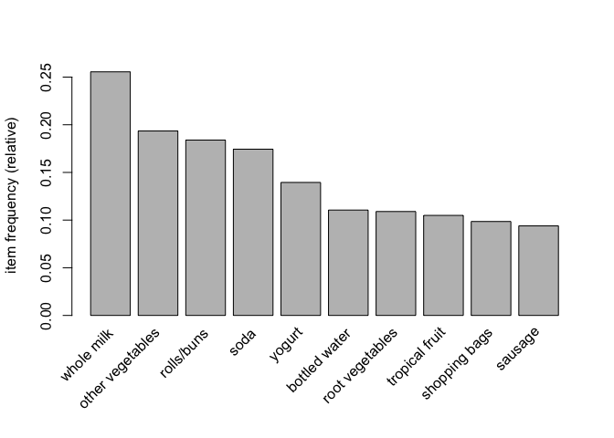<!-- -->

  - Setting the apriori algorithm with the below parameter list: Look at
    rules with support greater than 0.001, confidence greater than 0.8
    and length of each transaction upto 6

<!-- end list -->

    ## Apriori
    ## 
    ## Parameter specification:
    ##  confidence minval smax arem  aval originalSupport maxtime support minlen
    ##         0.8    0.1    1 none FALSE            TRUE       5   0.001      1
    ##  maxlen target   ext
    ##      10  rules FALSE
    ## 
    ## Algorithmic control:
    ##  filter tree heap memopt load sort verbose
    ##     0.1 TRUE TRUE  FALSE TRUE    2    TRUE
    ## 
    ## Absolute minimum support count: 9 
    ## 
    ## set item appearances ...[0 item(s)] done [0.00s].
    ## set transactions ...[169 item(s), 9835 transaction(s)] done [0.00s].
    ## sorting and recoding items ... [157 item(s)] done [0.00s].
    ## creating transaction tree ... done [0.00s].
    ## checking subsets of size 1 2 3 4 5 6 done [0.01s].
    ## writing ... [410 rule(s)] done [0.00s].
    ## creating S4 object  ... done [0.00s].

\*First Table: we inspect the first 3 rules from the algorithm. For
example, let’s take row1. The two itemsets here are liquor,red/blush
wine and bottled beer. The support represents the fraction of occurence
of these itemsets together in the entire dataset. The two itemsets occur
together 0.19% times in the entire dataset. The confidence shows the
numberv of times bottled beer is present when the grocery basket
contains liquor and red/blush wine. This shows that 90.4% of baskets
which contain liquor and red/blush wine also contain bottled beer. The
lift is the ratio of the confidence in bottled beer being present with
liquor and red blush/wine to the total fraction of times bottled beer is
present. The lower the value of the lift, the more independent these two
itemsets are. Here, the lift is 11, signifying that the rule is
performing well.

\*Second Table: This is a subset of all itemsets which have a lift
greater than 5, signifying higher level of co-occurrence between them.
We can see that lift is higher with higher confidence and lower number
of times of occurrence of an itemset.For example, the confidence for
yogurt is higher than tropical fruit in line 3. However, the lift for
tropical fruit seems to be higher than yogurt. Thic could be because
tropical fruit maybe a more rarely purchased item than yogurt, thereby
increasing its lift.

\*Third table: List of rows with confidence \>0.6. This is the subset
where the conditional probability of an itemset in rhs occurring is
higher if corresponding itemset in lhs is present. We also notice
certain cases here where confidence is 1. For example, line 10 suggests
that if rice and sugar are present in the basket, then there is 100%
probability of whole milk being present in the same basket.

\*Fourth table: We see in the output that the support value across
different rows in the dataset is low. This could be because each basket
is highly varied, based on personal choice and hence, frequency of the
same basket occurring may not be high. For a support value greater than
0.003. we find only one row. We say in the entire dataset, the chances
of citrus fruit, tropical fruit, root vegetables, whole milk and other
vegetables occurring together is 0.3%

\*Fifth table: These are candidates with the highest lift, showing the
best performance of the association rule
    generated.

    ##     lhs                        rhs            support     confidence
    ## [1] {liquor,red/blush wine} => {bottled beer} 0.001931876 0.9047619 
    ## [2] {cereals,curd}          => {whole milk}   0.001016777 0.9090909 
    ## [3] {cereals,yogurt}        => {whole milk}   0.001728521 0.8095238 
    ##     lift      count
    ## [1] 11.235269 19   
    ## [2]  3.557863 10   
    ## [3]  3.168192 17

    ##      lhs                        rhs                    support confidence      lift count
    ## [1]  {liquor,                                                                            
    ##       red/blush wine}        => {bottled beer}     0.001931876  0.9047619 11.235269    19
    ## [2]  {citrus fruit,                                                                      
    ##       root vegetables,                                                                   
    ##       soft cheese}           => {other vegetables} 0.001016777  1.0000000  5.168156    10
    ## [3]  {citrus fruit,                                                                      
    ##       fruit/vegetable juice,                                                             
    ##       grapes}                => {tropical fruit}   0.001118454  0.8461538  8.063879    11
    ## [4]  {butter milk,                                                                       
    ##       other vegetables,                                                                  
    ##       pastry}                => {yogurt}           0.001220132  0.8000000  5.734694    12
    ## [5]  {pip fruit,                                                                         
    ##       sausage,                                                                           
    ##       sliced cheese}         => {yogurt}           0.001220132  0.8571429  6.144315    12
    ## [6]  {cream cheese,                                                                      
    ##       margarine,                                                                         
    ##       whipped/sour cream}    => {yogurt}           0.001016777  0.8333333  5.973639    10
    ## [7]  {butter,                                                                            
    ##       cream cheese,                                                                      
    ##       root vegetables}       => {yogurt}           0.001016777  0.9090909  6.516698    10
    ## [8]  {butter,                                                                            
    ##       tropical fruit,                                                                    
    ##       white bread}           => {yogurt}           0.001118454  0.8461538  6.065542    11
    ## [9]  {beef,                                                                              
    ##       butter,                                                                            
    ##       tropical fruit}        => {yogurt}           0.001016777  0.8333333  5.973639    10
    ## [10] {fruit/vegetable juice,                                                             
    ##       pork,                                                                              
    ##       tropical fruit}        => {yogurt}           0.001016777  0.8333333  5.973639    10
    ## [11] {brown bread,                                                                       
    ##       pip fruit,                                                                         
    ##       whipped/sour cream}    => {other vegetables} 0.001118454  1.0000000  5.168156    11
    ## [12] {butter,                                                                            
    ##       margarine,                                                                         
    ##       tropical fruit}        => {yogurt}           0.001118454  0.8461538  6.065542    11
    ## [13] {fruit/vegetable juice,                                                             
    ##       pastry,                                                                            
    ##       whipped/sour cream}    => {yogurt}           0.001220132  0.8000000  5.734694    12
    ## [14] {other vegetables,                                                                  
    ##       rice,                                                                              
    ##       whole milk,                                                                        
    ##       yogurt}                => {root vegetables}  0.001321810  0.8666667  7.951182    13
    ## [15] {grapes,                                                                            
    ##       tropical fruit,                                                                    
    ##       whole milk,                                                                        
    ##       yogurt}                => {other vegetables} 0.001016777  1.0000000  5.168156    10
    ## [16] {ham,                                                                               
    ##       pip fruit,                                                                         
    ##       tropical fruit,                                                                    
    ##       yogurt}                => {other vegetables} 0.001016777  1.0000000  5.168156    10
    ## [17] {ham,                                                                               
    ##       other vegetables,                                                                  
    ##       pip fruit,                                                                         
    ##       yogurt}                => {tropical fruit}   0.001016777  0.8333333  7.941699    10
    ## [18] {ham,                                                                               
    ##       pip fruit,                                                                         
    ##       tropical fruit,                                                                    
    ##       whole milk}            => {other vegetables} 0.001118454  1.0000000  5.168156    11
    ## [19] {butter,                                                                            
    ##       sliced cheese,                                                                     
    ##       tropical fruit,                                                                    
    ##       whole milk}            => {yogurt}           0.001016777  0.9090909  6.516698    10
    ## [20] {oil,                                                                               
    ##       other vegetables,                                                                  
    ##       tropical fruit,                                                                    
    ##       whole milk}            => {root vegetables}  0.001321810  0.8666667  7.951182    13
    ## [21] {cream cheese,                                                                      
    ##       curd,                                                                              
    ##       other vegetables,                                                                  
    ##       whipped/sour cream}    => {yogurt}           0.001016777  0.9090909  6.516698    10
    ## [22] {cream cheese,                                                                      
    ##       curd,                                                                              
    ##       whipped/sour cream,                                                                
    ##       whole milk}            => {yogurt}           0.001118454  0.8461538  6.065542    11
    ## [23] {butter,                                                                            
    ##       other vegetables,                                                                  
    ##       tropical fruit,                                                                    
    ##       white bread}           => {yogurt}           0.001016777  0.9090909  6.516698    10
    ## [24] {beef,                                                                              
    ##       citrus fruit,                                                                      
    ##       other vegetables,                                                                  
    ##       tropical fruit}        => {root vegetables}  0.001016777  0.8333333  7.645367    10
    ## [25] {butter,                                                                            
    ##       curd,                                                                              
    ##       other vegetables,                                                                  
    ##       tropical fruit}        => {yogurt}           0.001016777  0.8333333  5.973639    10
    ## [26] {butter,                                                                            
    ##       curd,                                                                              
    ##       tropical fruit,                                                                    
    ##       whole milk}            => {yogurt}           0.001220132  0.8571429  6.144315    12
    ## [27] {margarine,                                                                         
    ##       root vegetables,                                                                   
    ##       tropical fruit,                                                                    
    ##       whole milk}            => {yogurt}           0.001016777  0.8333333  5.973639    10
    ## [28] {butter,                                                                            
    ##       fruit/vegetable juice,                                                             
    ##       tropical fruit,                                                                    
    ##       whipped/sour cream}    => {other vegetables} 0.001016777  1.0000000  5.168156    10
    ## [29] {newspapers,                                                                        
    ##       rolls/buns,                                                                        
    ##       soda,                                                                              
    ##       whole milk}            => {other vegetables} 0.001016777  1.0000000  5.168156    10
    ## [30] {citrus fruit,                                                                      
    ##       fruit/vegetable juice,                                                             
    ##       other vegetables,                                                                  
    ##       soda}                  => {root vegetables}  0.001016777  0.9090909  8.340400    10
    ## [31] {citrus fruit,                                                                      
    ##       root vegetables,                                                                   
    ##       tropical fruit,                                                                    
    ##       whipped/sour cream}    => {other vegetables} 0.001220132  1.0000000  5.168156    12
    ## [32] {oil,                                                                               
    ##       other vegetables,                                                                  
    ##       tropical fruit,                                                                    
    ##       whole milk,                                                                        
    ##       yogurt}                => {root vegetables}  0.001016777  0.9090909  8.340400    10

    ##       lhs                           rhs                    support confidence      lift count
    ## [1]   {liquor,                                                                               
    ##        red/blush wine}           => {bottled beer}     0.001931876  0.9047619 11.235269    19
    ## [2]   {cereals,                                                                              
    ##        curd}                     => {whole milk}       0.001016777  0.9090909  3.557863    10
    ## [3]   {cereals,                                                                              
    ##        yogurt}                   => {whole milk}       0.001728521  0.8095238  3.168192    17
    ## [4]   {butter,                                                                               
    ##        jam}                      => {whole milk}       0.001016777  0.8333333  3.261374    10
    ## [5]   {bottled beer,                                                                         
    ##        soups}                    => {whole milk}       0.001118454  0.9166667  3.587512    11
    ## [6]   {house keeping products,                                                               
    ##        napkins}                  => {whole milk}       0.001321810  0.8125000  3.179840    13
    ## [7]   {house keeping products,                                                               
    ##        whipped/sour cream}       => {whole milk}       0.001220132  0.9230769  3.612599    12
    ## [8]   {pastry,                                                                               
    ##        sweet spreads}            => {whole milk}       0.001016777  0.9090909  3.557863    10
    ## [9]   {curd,                                                                                 
    ##        turkey}                   => {other vegetables} 0.001220132  0.8000000  4.134524    12
    ## [10]  {rice,                                                                                 
    ##        sugar}                    => {whole milk}       0.001220132  1.0000000  3.913649    12
    ## [11]  {butter,                                                                               
    ##        rice}                     => {whole milk}       0.001525165  0.8333333  3.261374    15
    ## [12]  {domestic eggs,                                                                        
    ##        rice}                     => {whole milk}       0.001118454  0.8461538  3.311549    11
    ## [13]  {bottled water,                                                                        
    ##        rice}                     => {whole milk}       0.001220132  0.9230769  3.612599    12
    ## [14]  {rice,                                                                                 
    ##        yogurt}                   => {other vegetables} 0.001931876  0.8260870  4.269346    19
    ## [15]  {mustard,                                                                              
    ##        oil}                      => {whole milk}       0.001220132  0.8571429  3.354556    12
    ## [16]  {canned fish,                                                                          
    ##        hygiene articles}         => {whole milk}       0.001118454  1.0000000  3.913649    11
    ## [17]  {fruit/vegetable juice,                                                                
    ##        herbs}                    => {other vegetables} 0.001220132  0.8000000  4.134524    12
    ## [18]  {herbs,                                                                                
    ##        shopping bags}            => {other vegetables} 0.001931876  0.8260870  4.269346    19
    ## [19]  {herbs,                                                                                
    ##        tropical fruit}           => {whole milk}       0.002338587  0.8214286  3.214783    23
    ## [20]  {herbs,                                                                                
    ##        rolls/buns}               => {whole milk}       0.002440264  0.8000000  3.130919    24
    ## [21]  {chocolate,                                                                            
    ##        pickled vegetables}       => {whole milk}       0.001220132  0.8571429  3.354556    12
    ## [22]  {grapes,                                                                               
    ##        onions}                   => {other vegetables} 0.001118454  0.9166667  4.737476    11
    ## [23]  {margarine,                                                                            
    ##        meat}                     => {other vegetables} 0.001728521  0.8500000  4.392932    17
    ## [24]  {hard cheese,                                                                          
    ##        oil}                      => {other vegetables} 0.001118454  0.9166667  4.737476    11
    ## [25]  {butter milk,                                                                          
    ##        onions}                   => {other vegetables} 0.001321810  0.8125000  4.199126    13
    ## [26]  {butter milk,                                                                          
    ##        pork}                     => {other vegetables} 0.001830198  0.8571429  4.429848    18
    ## [27]  {onions,                                                                               
    ##        waffles}                  => {other vegetables} 0.001220132  0.8000000  4.134524    12
    ## [28]  {curd,                                                                                 
    ##        hamburger meat}           => {whole milk}       0.002541942  0.8064516  3.156169    25
    ## [29]  {bottled beer,                                                                         
    ##        hamburger meat}           => {whole milk}       0.001728521  0.8095238  3.168192    17
    ## [30]  {other vegetables,                                                                     
    ##        specialty cheese,                                                                     
    ##        yogurt}                   => {whole milk}       0.001321810  0.8125000  3.179840    13
    ## [31]  {root vegetables,                                                                      
    ##        tropical fruit,                                                                       
    ##        turkey}                   => {other vegetables} 0.001220132  0.8000000  4.134524    12
    ## [32]  {root vegetables,                                                                      
    ##        turkey,                                                                               
    ##        whole milk}               => {other vegetables} 0.001220132  0.8000000  4.134524    12
    ## [33]  {butter,                                                                               
    ##        rice,                                                                                 
    ##        root vegetables}          => {whole milk}       0.001016777  1.0000000  3.913649    10
    ## [34]  {other vegetables,                                                                     
    ##        rice,                                                                                 
    ##        tropical fruit}           => {whole milk}       0.001016777  0.8333333  3.261374    10
    ## [35]  {rice,                                                                                 
    ##        root vegetables,                                                                      
    ##        yogurt}                   => {other vegetables} 0.001423488  0.8750000  4.522136    14
    ## [36]  {rice,                                                                                 
    ##        root vegetables,                                                                      
    ##        yogurt}                   => {whole milk}       0.001423488  0.8750000  3.424443    14
    ## [37]  {other vegetables,                                                                     
    ##        rice,                                                                                 
    ##        root vegetables}          => {whole milk}       0.001830198  0.8181818  3.202076    18
    ## [38]  {rice,                                                                                 
    ##        whole milk,                                                                           
    ##        yogurt}                   => {other vegetables} 0.001525165  0.8333333  4.306796    15
    ## [39]  {frozen fish,                                                                          
    ##        pip fruit,                                                                            
    ##        tropical fruit}           => {other vegetables} 0.001016777  0.8333333  4.306796    10
    ## [40]  {frozen fish,                                                                          
    ##        pip fruit,                                                                            
    ##        whole milk}               => {other vegetables} 0.001118454  0.8461538  4.373055    11
    ## [41]  {frozen fish,                                                                          
    ##        root vegetables,                                                                      
    ##        yogurt}                   => {whole milk}       0.001220132  0.8571429  3.354556    12
    ## [42]  {frozen fish,                                                                          
    ##        other vegetables,                                                                     
    ##        yogurt}                   => {whole milk}       0.001220132  0.8571429  3.354556    12
    ## [43]  {curd,                                                                                 
    ##        herbs,                                                                                
    ##        root vegetables}          => {whole milk}       0.001220132  0.8571429  3.354556    12
    ## [44]  {domestic eggs,                                                                        
    ##        herbs,                                                                                
    ##        other vegetables}         => {whole milk}       0.001016777  0.8333333  3.261374    10
    ## [45]  {fruit/vegetable juice,                                                                
    ##        herbs,                                                                                
    ##        other vegetables}         => {whole milk}       0.001016777  0.8333333  3.261374    10
    ## [46]  {fruit/vegetable juice,                                                                
    ##        herbs,                                                                                
    ##        whole milk}               => {other vegetables} 0.001016777  0.9090909  4.698323    10
    ## [47]  {citrus fruit,                                                                         
    ##        herbs,                                                                                
    ##        tropical fruit}           => {other vegetables} 0.001016777  0.8333333  4.306796    10
    ## [48]  {citrus fruit,                                                                         
    ##        herbs,                                                                                
    ##        tropical fruit}           => {whole milk}       0.001118454  0.9166667  3.587512    11
    ## [49]  {citrus fruit,                                                                         
    ##        herbs,                                                                                
    ##        root vegetables}          => {other vegetables} 0.001321810  0.8125000  4.199126    13
    ## [50]  {citrus fruit,                                                                         
    ##        herbs,                                                                                
    ##        root vegetables}          => {whole milk}       0.001321810  0.8125000  3.179840    13
    ## [51]  {herbs,                                                                                
    ##        root vegetables,                                                                      
    ##        shopping bags}            => {other vegetables} 0.001118454  0.8461538  4.373055    11
    ## [52]  {herbs,                                                                                
    ##        root vegetables,                                                                      
    ##        tropical fruit}           => {whole milk}       0.001525165  0.8823529  3.453220    15
    ## [53]  {herbs,                                                                                
    ##        tropical fruit,                                                                       
    ##        yogurt}                   => {whole milk}       0.001016777  0.8333333  3.261374    10
    ## [54]  {herbs,                                                                                
    ##        other vegetables,                                                                     
    ##        tropical fruit}           => {whole milk}       0.001321810  0.8125000  3.179840    13
    ## [55]  {herbs,                                                                                
    ##        rolls/buns,                                                                           
    ##        root vegetables}          => {whole milk}       0.001525165  0.8333333  3.261374    15
    ## [56]  {semi-finished bread,                                                                  
    ##        tropical fruit,                                                                       
    ##        yogurt}                   => {other vegetables} 0.001321810  0.8125000  4.199126    13
    ## [57]  {detergent,                                                                            
    ##        other vegetables,                                                                     
    ##        whipped/sour cream}       => {whole milk}       0.001016777  0.8333333  3.261374    10
    ## [58]  {baking powder,                                                                        
    ##        tropical fruit,                                                                       
    ##        yogurt}                   => {whole milk}       0.001118454  0.8461538  3.311549    11
    ## [59]  {flour,                                                                                
    ##        other vegetables,                                                                     
    ##        sugar}                    => {whole milk}       0.001220132  0.8571429  3.354556    12
    ## [60]  {flour,                                                                                
    ##        root vegetables,                                                                      
    ##        whipped/sour cream}       => {whole milk}       0.001728521  1.0000000  3.913649    17
    ## [61]  {flour,                                                                                
    ##        rolls/buns,                                                                           
    ##        root vegetables}          => {other vegetables} 0.001016777  0.8333333  4.306796    10
    ## [62]  {butter,                                                                               
    ##        domestic eggs,                                                                        
    ##        soft cheese}              => {whole milk}       0.001016777  1.0000000  3.913649    10
    ## [63]  {butter,                                                                               
    ##        soft cheese,                                                                          
    ##        yogurt}                   => {whole milk}       0.001220132  0.8000000  3.130919    12
    ## [64]  {domestic eggs,                                                                        
    ##        root vegetables,                                                                      
    ##        soft cheese}              => {other vegetables} 0.001016777  0.8333333  4.306796    10
    ## [65]  {domestic eggs,                                                                        
    ##        root vegetables,                                                                      
    ##        soft cheese}              => {whole milk}       0.001016777  0.8333333  3.261374    10
    ## [66]  {soft cheese,                                                                          
    ##        tropical fruit,                                                                       
    ##        whipped/sour cream}       => {other vegetables} 0.001220132  0.9230769  4.770605    12
    ## [67]  {root vegetables,                                                                      
    ##        soft cheese,                                                                          
    ##        whipped/sour cream}       => {whole milk}       0.001220132  0.9230769  3.612599    12
    ## [68]  {citrus fruit,                                                                         
    ##        root vegetables,                                                                      
    ##        soft cheese}              => {other vegetables} 0.001016777  1.0000000  5.168156    10
    ## [69]  {grapes,                                                                               
    ##        pork,                                                                                 
    ##        whole milk}               => {other vegetables} 0.001016777  0.8333333  4.306796    10
    ## [70]  {citrus fruit,                                                                         
    ##        fruit/vegetable juice,                                                                
    ##        grapes}                   => {tropical fruit}   0.001118454  0.8461538  8.063879    11
    ## [71]  {grapes,                                                                               
    ##        root vegetables,                                                                      
    ##        tropical fruit}           => {other vegetables} 0.001220132  0.8000000  4.134524    12
    ## [72]  {grapes,                                                                               
    ##        tropical fruit,                                                                       
    ##        yogurt}                   => {other vegetables} 0.001423488  0.8235294  4.256128    14
    ## [73]  {grapes,                                                                               
    ##        tropical fruit,                                                                       
    ##        whole milk}               => {other vegetables} 0.002033554  0.8000000  4.134524    20
    ## [74]  {meat,                                                                                 
    ##        tropical fruit,                                                                       
    ##        whole milk}               => {other vegetables} 0.001016777  0.8333333  4.306796    10
    ## [75]  {meat,                                                                                 
    ##        root vegetables,                                                                      
    ##        yogurt}                   => {other vegetables} 0.001220132  0.8571429  4.429848    12
    ## [76]  {curd,                                                                                 
    ##        frozen meals,                                                                         
    ##        yogurt}                   => {whole milk}       0.001118454  0.8461538  3.311549    11
    ## [77]  {frankfurter,                                                                          
    ##        frozen meals,                                                                         
    ##        tropical fruit}           => {other vegetables} 0.001016777  0.9090909  4.698323    10
    ## [78]  {frankfurter,                                                                          
    ##        frozen meals,                                                                         
    ##        tropical fruit}           => {whole milk}       0.001016777  0.9090909  3.557863    10
    ## [79]  {frankfurter,                                                                          
    ##        frozen meals,                                                                         
    ##        other vegetables}         => {whole milk}       0.001220132  0.8000000  3.130919    12
    ## [80]  {butter,                                                                               
    ##        frozen meals,                                                                         
    ##        tropical fruit}           => {whole milk}       0.001016777  0.9090909  3.557863    10
    ## [81]  {frozen meals,                                                                         
    ##        root vegetables,                                                                      
    ##        tropical fruit}           => {whole milk}       0.001118454  0.8461538  3.311549    11
    ## [82]  {frozen meals,                                                                         
    ##        tropical fruit,                                                                       
    ##        yogurt}                   => {whole milk}       0.001626843  0.8000000  3.130919    16
    ## [83]  {butter,                                                                               
    ##        hard cheese,                                                                          
    ##        yogurt}                   => {whole milk}       0.001321810  0.8125000  3.179840    13
    ## [84]  {hard cheese,                                                                          
    ##        tropical fruit,                                                                       
    ##        whipped/sour cream}       => {other vegetables} 0.001016777  0.9090909  4.698323    10
    ## [85]  {hard cheese,                                                                          
    ##        root vegetables,                                                                      
    ##        whipped/sour cream}       => {other vegetables} 0.001321810  0.8125000  4.199126    13
    ## [86]  {hard cheese,                                                                          
    ##        tropical fruit,                                                                       
    ##        yogurt}                   => {whole milk}       0.001423488  0.8235294  3.223005    14
    ## [87]  {butter milk,                                                                          
    ##        dessert,                                                                              
    ##        yogurt}                   => {whole milk}       0.001321810  0.8125000  3.179840    13
    ## [88]  {butter milk,                                                                          
    ##        pork,                                                                                 
    ##        whole milk}               => {other vegetables} 0.001016777  0.9090909  4.698323    10
    ## [89]  {butter milk,                                                                          
    ##        fruit/vegetable juice,                                                                
    ##        pip fruit}                => {other vegetables} 0.001016777  0.9090909  4.698323    10
    ## [90]  {butter milk,                                                                          
    ##        pip fruit,                                                                            
    ##        root vegetables}          => {other vegetables} 0.001220132  0.8571429  4.429848    12
    ## [91]  {butter milk,                                                                          
    ##        other vegetables,                                                                     
    ##        pastry}                   => {yogurt}           0.001220132  0.8000000  5.734694    12
    ## [92]  {butter milk,                                                                          
    ##        sausage,                                                                              
    ##        yogurt}                   => {whole milk}       0.001118454  0.8461538  3.311549    11
    ## [93]  {butter milk,                                                                          
    ##        root vegetables,                                                                      
    ##        yogurt}                   => {whole milk}       0.001525165  0.8823529  3.453220    15
    ## [94]  {candy,                                                                                
    ##        rolls/buns,                                                                           
    ##        root vegetables}          => {other vegetables} 0.001016777  0.8333333  4.306796    10
    ## [95]  {frozen vegetables,                                                                    
    ##        ham,                                                                                  
    ##        whole milk}               => {other vegetables} 0.001016777  0.8333333  4.306796    10
    ## [96]  {ham,                                                                                  
    ##        pip fruit,                                                                            
    ##        tropical fruit}           => {other vegetables} 0.001626843  0.8888889  4.593916    16
    ## [97]  {frankfurter,                                                                          
    ##        root vegetables,                                                                      
    ##        sliced cheese}            => {whole milk}       0.001016777  0.9090909  3.557863    10
    ## [98]  {frankfurter,                                                                          
    ##        sliced cheese,                                                                        
    ##        yogurt}                   => {whole milk}       0.001016777  0.8333333  3.261374    10
    ## [99]  {butter,                                                                               
    ##        sliced cheese,                                                                        
    ##        whipped/sour cream}       => {whole milk}       0.001220132  0.9230769  3.612599    12
    ## [100] {pip fruit,                                                                            
    ##        sausage,                                                                              
    ##        sliced cheese}            => {yogurt}           0.001220132  0.8571429  6.144315    12
    ## [101] {coffee,                                                                               
    ##        oil,                                                                                  
    ##        yogurt}                   => {other vegetables} 0.001016777  0.9090909  4.698323    10
    ## [102] {citrus fruit,                                                                         
    ##        fruit/vegetable juice,                                                                
    ##        oil}                      => {other vegetables} 0.001118454  0.8461538  4.373055    11
    ## [103] {fruit/vegetable juice,                                                                
    ##        oil,                                                                                  
    ##        tropical fruit}           => {other vegetables} 0.001220132  0.8571429  4.429848    12
    ## [104] {oil,                                                                                  
    ##        root vegetables,                                                                      
    ##        shopping bags}            => {whole milk}       0.001016777  0.8333333  3.261374    10
    ## [105] {oil,                                                                                  
    ##        root vegetables,                                                                      
    ##        tropical fruit}           => {other vegetables} 0.001728521  0.8500000  4.392932    17
    ## [106] {frozen vegetables,                                                                    
    ##        onions,                                                                               
    ##        root vegetables}          => {other vegetables} 0.001321810  0.8666667  4.479068    13
    ## [107] {curd,                                                                                 
    ##        onions,                                                                               
    ##        yogurt}                   => {whole milk}       0.001118454  0.8461538  3.311549    11
    ## [108] {napkins,                                                                              
    ##        onions,                                                                               
    ##        root vegetables}          => {other vegetables} 0.001016777  0.9090909  4.698323    10
    ## [109] {napkins,                                                                              
    ##        onions,                                                                               
    ##        whole milk}               => {other vegetables} 0.001220132  0.8000000  4.134524    12
    ## [110] {butter,                                                                               
    ##        domestic eggs,                                                                        
    ##        onions}                   => {whole milk}       0.001118454  0.8461538  3.311549    11
    ## [111] {bottled water,                                                                        
    ##        butter,                                                                               
    ##        onions}                   => {whole milk}       0.001016777  0.8333333  3.261374    10
    ## [112] {butter,                                                                               
    ##        onions,                                                                               
    ##        tropical fruit}           => {whole milk}       0.001220132  0.8571429  3.354556    12
    ## [113] {butter,                                                                               
    ##        onions,                                                                               
    ##        root vegetables}          => {whole milk}       0.001728521  0.8500000  3.326602    17
    ## [114] {butter,                                                                               
    ##        onions,                                                                               
    ##        yogurt}                   => {whole milk}       0.001321810  0.8125000  3.179840    13
    ## [115] {citrus fruit,                                                                         
    ##        onions,                                                                               
    ##        root vegetables}          => {other vegetables} 0.001423488  0.8235294  4.256128    14
    ## [116] {onions,                                                                               
    ##        root vegetables,                                                                      
    ##        tropical fruit}           => {other vegetables} 0.001626843  0.8888889  4.593916    16
    ## [117] {berries,                                                                              
    ##        butter,                                                                               
    ##        whipped/sour cream}       => {whole milk}       0.001016777  0.8333333  3.261374    10
    ## [118] {berries,                                                                              
    ##        butter,                                                                               
    ##        sausage}                  => {whole milk}       0.001016777  0.9090909  3.557863    10
    ## [119] {curd,                                                                                 
    ##        hamburger meat,                                                                       
    ##        other vegetables}         => {whole milk}       0.001626843  0.8000000  3.130919    16
    ## [120] {butter,                                                                               
    ##        hamburger meat,                                                                       
    ##        whipped/sour cream}       => {whole milk}       0.001220132  0.8000000  3.130919    12
    ## [121] {hamburger meat,                                                                       
    ##        tropical fruit,                                                                       
    ##        whipped/sour cream}       => {other vegetables} 0.001016777  0.9090909  4.698323    10
    ## [122] {hamburger meat,                                                                       
    ##        root vegetables,                                                                      
    ##        whipped/sour cream}       => {whole milk}       0.001016777  0.8333333  3.261374    10
    ## [123] {butter,                                                                               
    ##        hygiene articles,                                                                     
    ##        napkins}                  => {whole milk}       0.001016777  0.9090909  3.557863    10
    ## [124] {hygiene articles,                                                                     
    ##        napkins,                                                                              
    ##        tropical fruit}           => {whole milk}       0.001220132  0.8000000  3.130919    12
    ## [125] {hygiene articles,                                                                     
    ##        margarine,                                                                            
    ##        rolls/buns}               => {whole milk}       0.001016777  0.8333333  3.261374    10
    ## [126] {butter,                                                                               
    ##        hygiene articles,                                                                     
    ##        pip fruit}                => {whole milk}       0.001016777  1.0000000  3.913649    10
    ## [127] {butter,                                                                               
    ##        citrus fruit,                                                                         
    ##        hygiene articles}         => {whole milk}       0.001016777  0.8333333  3.261374    10
    ## [128] {bottled water,                                                                        
    ##        butter,                                                                               
    ##        hygiene articles}         => {whole milk}       0.001220132  0.8571429  3.354556    12
    ## [129] {butter,                                                                               
    ##        hygiene articles,                                                                     
    ##        tropical fruit}           => {whole milk}       0.001220132  0.9230769  3.612599    12
    ## [130] {butter,                                                                               
    ##        hygiene articles,                                                                     
    ##        root vegetables}          => {whole milk}       0.001423488  0.8235294  3.223005    14
    ## [131] {domestic eggs,                                                                        
    ##        hygiene articles,                                                                     
    ##        tropical fruit}           => {whole milk}       0.001220132  0.9230769  3.612599    12
    ## [132] {hygiene articles,                                                                     
    ##        tropical fruit,                                                                       
    ##        whipped/sour cream}       => {whole milk}       0.001016777  0.8333333  3.261374    10
    ## [133] {hygiene articles,                                                                     
    ##        root vegetables,                                                                      
    ##        whipped/sour cream}       => {whole milk}       0.001016777  1.0000000  3.913649    10
    ## [134] {hygiene articles,                                                                     
    ##        pip fruit,                                                                            
    ##        sausage}                  => {whole milk}       0.001321810  0.8125000  3.179840    13
    ## [135] {hygiene articles,                                                                     
    ##        pip fruit,                                                                            
    ##        root vegetables}          => {whole milk}       0.001016777  1.0000000  3.913649    10
    ## [136] {citrus fruit,                                                                         
    ##        hygiene articles,                                                                     
    ##        root vegetables}          => {whole milk}       0.001220132  0.8571429  3.354556    12
    ## [137] {hygiene articles,                                                                     
    ##        root vegetables,                                                                      
    ##        yogurt}                   => {whole milk}       0.001220132  0.8571429  3.354556    12
    ## [138] {long life bakery product,                                                             
    ##        other vegetables,                                                                     
    ##        salty snack}              => {whole milk}       0.001016777  0.8333333  3.261374    10
    ## [139] {salty snack,                                                                          
    ##        tropical fruit,                                                                       
    ##        whipped/sour cream}       => {other vegetables} 0.001220132  0.8000000  4.134524    12
    ## [140] {pip fruit,                                                                            
    ##        salty snack,                                                                          
    ##        yogurt}                   => {whole milk}       0.001118454  0.8461538  3.311549    11
    ## [141] {salty snack,                                                                          
    ##        tropical fruit,                                                                       
    ##        yogurt}                   => {other vegetables} 0.001321810  0.8125000  4.199126    13
    ## [142] {root vegetables,                                                                      
    ##        salty snack,                                                                          
    ##        yogurt}                   => {other vegetables} 0.001220132  0.8571429  4.429848    12
    ## [143] {cream cheese,                                                                         
    ##        domestic eggs,                                                                        
    ##        sugar}                    => {whole milk}       0.001118454  1.0000000  3.913649    11
    ## [144] {cream cheese,                                                                         
    ##        other vegetables,                                                                     
    ##        sugar}                    => {whole milk}       0.001525165  0.9375000  3.669046    15
    ## [145] {beef,                                                                                 
    ##        root vegetables,                                                                      
    ##        sugar}                    => {other vegetables} 0.001118454  0.8461538  4.373055    11
    ## [146] {curd,                                                                                 
    ##        domestic eggs,                                                                        
    ##        sugar}                    => {whole milk}       0.001016777  1.0000000  3.913649    10
    ## [147] {butter,                                                                               
    ##        sugar,                                                                                
    ##        whipped/sour cream}       => {other vegetables} 0.001016777  0.8333333  4.306796    10
    ## [148] {butter,                                                                               
    ##        sugar,                                                                                
    ##        whipped/sour cream}       => {whole milk}       0.001016777  0.8333333  3.261374    10
    ## [149] {citrus fruit,                                                                         
    ##        domestic eggs,                                                                        
    ##        sugar}                    => {whole milk}       0.001423488  0.9333333  3.652739    14
    ## [150] {domestic eggs,                                                                        
    ##        sugar,                                                                                
    ##        tropical fruit}           => {whole milk}       0.001118454  0.9166667  3.587512    11
    ## [151] {domestic eggs,                                                                        
    ##        sugar,                                                                                
    ##        yogurt}                   => {whole milk}       0.001423488  0.9333333  3.652739    14
    ## [152] {citrus fruit,                                                                         
    ##        sugar,                                                                                
    ##        whipped/sour cream}       => {whole milk}       0.001118454  0.8461538  3.311549    11
    ## [153] {root vegetables,                                                                      
    ##        sugar,                                                                                
    ##        whipped/sour cream}       => {whole milk}       0.001220132  0.9230769  3.612599    12
    ## [154] {bottled water,                                                                        
    ##        other vegetables,                                                                     
    ##        sugar}                    => {whole milk}       0.001321810  0.8125000  3.179840    13
    ## [155] {pork,                                                                                 
    ##        rolls/buns,                                                                           
    ##        waffles}                  => {whole milk}       0.001016777  0.9090909  3.557863    10
    ## [156] {rolls/buns,                                                                           
    ##        waffles,                                                                              
    ##        whipped/sour cream}       => {whole milk}       0.001728521  0.8095238  3.168192    17
    ## [157] {rolls/buns,                                                                           
    ##        root vegetables,                                                                      
    ##        waffles}                  => {whole milk}       0.001626843  0.8421053  3.295704    16
    ## [158] {long life bakery product,                                                             
    ##        napkins,                                                                              
    ##        whipped/sour cream}       => {whole milk}       0.001016777  0.9090909  3.557863    10
    ## [159] {long life bakery product,                                                             
    ##        napkins,                                                                              
    ##        tropical fruit}           => {whole milk}       0.001220132  0.9230769  3.612599    12
    ## [160] {long life bakery product,                                                             
    ##        napkins,                                                                              
    ##        other vegetables}         => {whole milk}       0.001220132  0.8571429  3.354556    12
    ## [161] {butter,                                                                               
    ##        long life bakery product,                                                             
    ##        whipped/sour cream}       => {other vegetables} 0.001220132  0.8000000  4.134524    12
    ## [162] {butter,                                                                               
    ##        long life bakery product,                                                             
    ##        sausage}                  => {whole milk}       0.001016777  0.9090909  3.557863    10
    ## [163] {long life bakery product,                                                             
    ##        sausage,                                                                              
    ##        whipped/sour cream}       => {whole milk}       0.001016777  0.8333333  3.261374    10
    ## [164] {long life bakery product,                                                             
    ##        whipped/sour cream,                                                                   
    ##        yogurt}                   => {whole milk}       0.001728521  0.8095238  3.168192    17
    ## [165] {long life bakery product,                                                             
    ##        root vegetables,                                                                      
    ##        tropical fruit}           => {other vegetables} 0.001118454  0.8461538  4.373055    11
    ## [166] {dessert,                                                                              
    ##        sausage,                                                                              
    ##        whipped/sour cream}       => {other vegetables} 0.001016777  0.8333333  4.306796    10
    ## [167] {dessert,                                                                              
    ##        tropical fruit,                                                                       
    ##        whipped/sour cream}       => {other vegetables} 0.001118454  0.9166667  4.737476    11
    ## [168] {cream cheese,                                                                         
    ##        curd,                                                                                 
    ##        root vegetables}          => {other vegetables} 0.001728521  0.8500000  4.392932    17
    ## [169] {cream cheese,                                                                         
    ##        domestic eggs,                                                                        
    ##        napkins}                  => {whole milk}       0.001118454  1.0000000  3.913649    11
    ## [170] {cream cheese,                                                                         
    ##        pork,                                                                                 
    ##        yogurt}                   => {whole milk}       0.001016777  0.8333333  3.261374    10
    ## [171] {cream cheese,                                                                         
    ##        frankfurter,                                                                          
    ##        yogurt}                   => {whole milk}       0.001016777  0.8333333  3.261374    10
    ## [172] {cream cheese,                                                                         
    ##        margarine,                                                                            
    ##        whipped/sour cream}       => {yogurt}           0.001016777  0.8333333  5.973639    10
    ## [173] {butter,                                                                               
    ##        cream cheese,                                                                         
    ##        whipped/sour cream}       => {whole milk}       0.001118454  0.8461538  3.311549    11
    ## [174] {butter,                                                                               
    ##        cream cheese,                                                                         
    ##        root vegetables}          => {yogurt}           0.001016777  0.9090909  6.516698    10
    ## [175] {butter,                                                                               
    ##        cream cheese,                                                                         
    ##        root vegetables}          => {whole milk}       0.001016777  0.9090909  3.557863    10
    ## [176] {cream cheese,                                                                         
    ##        domestic eggs,                                                                        
    ##        whipped/sour cream}       => {whole milk}       0.001220132  0.8571429  3.354556    12
    ## [177] {cream cheese,                                                                         
    ##        domestic eggs,                                                                        
    ##        pip fruit}                => {whole milk}       0.001118454  0.8461538  3.311549    11
    ## [178] {citrus fruit,                                                                         
    ##        cream cheese,                                                                         
    ##        domestic eggs}            => {whole milk}       0.001626843  0.8888889  3.478799    16
    ## [179] {cream cheese,                                                                         
    ##        domestic eggs,                                                                        
    ##        yogurt}                   => {whole milk}       0.001321810  0.8125000  3.179840    13
    ## [180] {cream cheese,                                                                         
    ##        pip fruit,                                                                            
    ##        whipped/sour cream}       => {whole milk}       0.001321810  0.9285714  3.634103    13
    ## [181] {citrus fruit,                                                                         
    ##        cream cheese,                                                                         
    ##        whipped/sour cream}       => {other vegetables} 0.001321810  0.8125000  4.199126    13
    ## [182] {cream cheese,                                                                         
    ##        tropical fruit,                                                                       
    ##        whipped/sour cream}       => {other vegetables} 0.001423488  0.8750000  4.522136    14
    ## [183] {cream cheese,                                                                         
    ##        pip fruit,                                                                            
    ##        sausage}                  => {whole milk}       0.001016777  0.9090909  3.557863    10
    ## [184] {citrus fruit,                                                                         
    ##        cream cheese,                                                                         
    ##        root vegetables}          => {other vegetables} 0.001220132  0.9230769  4.770605    12
    ## [185] {butter,                                                                               
    ##        chicken,                                                                              
    ##        whipped/sour cream}       => {whole milk}       0.001220132  0.8000000  3.130919    12
    ## [186] {chicken,                                                                              
    ##        domestic eggs,                                                                        
    ##        sausage}                  => {whole milk}       0.001220132  0.8571429  3.354556    12
    ## [187] {chicken,                                                                              
    ##        pastry,                                                                               
    ##        root vegetables}          => {other vegetables} 0.001016777  0.8333333  4.306796    10
    ## [188] {butter,                                                                               
    ##        tropical fruit,                                                                       
    ##        white bread}              => {yogurt}           0.001118454  0.8461538  6.065542    11
    ## [189] {butter,                                                                               
    ##        tropical fruit,                                                                       
    ##        white bread}              => {other vegetables} 0.001118454  0.8461538  4.373055    11
    ## [190] {butter,                                                                               
    ##        root vegetables,                                                                      
    ##        white bread}              => {other vegetables} 0.001016777  0.8333333  4.306796    10
    ## [191] {butter,                                                                               
    ##        root vegetables,                                                                      
    ##        white bread}              => {whole milk}       0.001118454  0.9166667  3.587512    11
    ## [192] {tropical fruit,                                                                       
    ##        whipped/sour cream,                                                                   
    ##        white bread}              => {other vegetables} 0.001728521  0.8500000  4.392932    17
    ## [193] {root vegetables,                                                                      
    ##        whipped/sour cream,                                                                   
    ##        white bread}              => {other vegetables} 0.001423488  0.8750000  4.522136    14
    ## [194] {root vegetables,                                                                      
    ##        whipped/sour cream,                                                                   
    ##        white bread}              => {whole milk}       0.001321810  0.8125000  3.179840    13
    ## [195] {chocolate,                                                                            
    ##        napkins,                                                                              
    ##        root vegetables}          => {whole milk}       0.001220132  0.8000000  3.130919    12
    ## [196] {chocolate,                                                                            
    ##        domestic eggs,                                                                        
    ##        sausage}                  => {whole milk}       0.001016777  0.8333333  3.261374    10
    ## [197] {bottled beer,                                                                         
    ##        coffee,                                                                               
    ##        yogurt}                   => {whole milk}       0.001016777  0.8333333  3.261374    10
    ## [198] {butter,                                                                               
    ##        coffee,                                                                               
    ##        whipped/sour cream}       => {whole milk}       0.001220132  0.9230769  3.612599    12
    ## [199] {coffee,                                                                               
    ##        domestic eggs,                                                                        
    ##        root vegetables}          => {whole milk}       0.001016777  0.9090909  3.557863    10
    ## [200] {citrus fruit,                                                                         
    ##        frozen vegetables,                                                                    
    ##        napkins}                  => {whole milk}       0.001118454  0.8461538  3.311549    11
    ## [201] {frozen vegetables,                                                                    
    ##        napkins,                                                                              
    ##        other vegetables}         => {whole milk}       0.001321810  0.8125000  3.179840    13
    ## [202] {frozen vegetables,                                                                    
    ##        margarine,                                                                            
    ##        rolls/buns}               => {whole milk}       0.001321810  0.8666667  3.391829    13
    ## [203] {citrus fruit,                                                                         
    ##        frozen vegetables,                                                                    
    ##        fruit/vegetable juice}    => {whole milk}       0.001626843  0.8421053  3.295704    16
    ## [204] {beef,                                                                                 
    ##        butter,                                                                               
    ##        curd}                     => {whole milk}       0.001016777  0.8333333  3.261374    10
    ## [205] {beef,                                                                                 
    ##        butter,                                                                               
    ##        tropical fruit}           => {yogurt}           0.001016777  0.8333333  5.973639    10
    ## [206] {beef,                                                                                 
    ##        tropical fruit,                                                                       
    ##        whipped/sour cream}       => {other vegetables} 0.001423488  0.8750000  4.522136    14
    ## [207] {beef,                                                                                 
    ##        tropical fruit,                                                                       
    ##        whipped/sour cream}       => {whole milk}       0.001321810  0.8125000  3.179840    13
    ## [208] {curd,                                                                                 
    ##        margarine,                                                                            
    ##        rolls/buns}               => {whole milk}       0.001321810  0.8125000  3.179840    13
    ## [209] {butter,                                                                               
    ##        curd,                                                                                 
    ##        domestic eggs}            => {other vegetables} 0.001016777  0.8333333  4.306796    10
    ## [210] {butter,                                                                               
    ##        curd,                                                                                 
    ##        domestic eggs}            => {whole milk}       0.001118454  0.9166667  3.587512    11
    ## [211] {butter,                                                                               
    ##        curd,                                                                                 
    ##        pip fruit}                => {whole milk}       0.001220132  0.8000000  3.130919    12
    ## [212] {butter,                                                                               
    ##        citrus fruit,                                                                         
    ##        curd}                     => {whole milk}       0.001118454  0.9166667  3.587512    11
    ## [213] {curd,                                                                                 
    ##        domestic eggs,                                                                        
    ##        other vegetables}         => {whole milk}       0.002846975  0.8235294  3.223005    28
    ## [214] {curd,                                                                                 
    ##        pip fruit,                                                                            
    ##        whipped/sour cream}       => {whole milk}       0.001830198  0.8181818  3.202076    18
    ## [215] {bottled beer,                                                                         
    ##        napkins,                                                                              
    ##        rolls/buns}               => {whole milk}       0.001220132  0.8000000  3.130919    12
    ## [216] {butter,                                                                               
    ##        napkins,                                                                              
    ##        whipped/sour cream}       => {whole milk}       0.001423488  0.8235294  3.223005    14
    ## [217] {bottled water,                                                                        
    ##        butter,                                                                               
    ##        napkins}                  => {whole milk}       0.001118454  0.8461538  3.311549    11
    ## [218] {butter,                                                                               
    ##        napkins,                                                                              
    ##        yogurt}                   => {whole milk}       0.001118454  0.8461538  3.311549    11
    ## [219] {domestic eggs,                                                                        
    ##        napkins,                                                                              
    ##        tropical fruit}           => {whole milk}       0.001321810  0.8125000  3.179840    13
    ## [220] {bottled beer,                                                                         
    ##        pork,                                                                                 
    ##        rolls/buns}               => {whole milk}       0.001118454  0.8461538  3.311549    11
    ## [221] {butter,                                                                               
    ##        pork,                                                                                 
    ##        whipped/sour cream}       => {whole milk}       0.001423488  0.8750000  3.424443    14
    ## [222] {butter,                                                                               
    ##        pork,                                                                                 
    ##        yogurt}                   => {whole milk}       0.001423488  0.8235294  3.223005    14
    ## [223] {butter,                                                                               
    ##        other vegetables,                                                                     
    ##        pork}                     => {whole milk}       0.002236909  0.8461538  3.311549    22
    ## [224] {fruit/vegetable juice,                                                                
    ##        pork,                                                                                 
    ##        tropical fruit}           => {yogurt}           0.001016777  0.8333333  5.973639    10
    ## [225] {pip fruit,                                                                            
    ##        pork,                                                                                 
    ##        soda}                     => {other vegetables} 0.001118454  0.8461538  4.373055    11
    ## [226] {bottled beer,                                                                         
    ##        domestic eggs,                                                                        
    ##        margarine}                => {whole milk}       0.001016777  0.9090909  3.557863    10
    ## [227] {brown bread,                                                                          
    ##        domestic eggs,                                                                        
    ##        root vegetables}          => {whole milk}       0.001525165  0.8333333  3.261374    15
    ## [228] {brown bread,                                                                          
    ##        pip fruit,                                                                            
    ##        whipped/sour cream}       => {other vegetables} 0.001118454  1.0000000  5.168156    11
    ## [229] {brown bread,                                                                          
    ##        sausage,                                                                              
    ##        whipped/sour cream}       => {other vegetables} 0.001016777  0.8333333  4.306796    10
    ## [230] {brown bread,                                                                          
    ##        pip fruit,                                                                            
    ##        root vegetables}          => {other vegetables} 0.001321810  0.8125000  4.199126    13
    ## [231] {brown bread,                                                                          
    ##        pip fruit,                                                                            
    ##        root vegetables}          => {whole milk}       0.001423488  0.8750000  3.424443    14
    ## [232] {butter,                                                                               
    ##        margarine,                                                                            
    ##        tropical fruit}           => {yogurt}           0.001118454  0.8461538  6.065542    11
    ## [233] {domestic eggs,                                                                        
    ##        fruit/vegetable juice,                                                                
    ##        margarine}                => {whole milk}       0.001118454  0.9166667  3.587512    11
    ## [234] {domestic eggs,                                                                        
    ##        margarine,                                                                            
    ##        whipped/sour cream}       => {whole milk}       0.001220132  0.8000000  3.130919    12
    ## [235] {bottled water,                                                                        
    ##        margarine,                                                                            
    ##        whipped/sour cream}       => {whole milk}       0.001016777  0.8333333  3.261374    10
    ## [236] {margarine,                                                                            
    ##        rolls/buns,                                                                           
    ##        whipped/sour cream}       => {whole milk}       0.001626843  0.8888889  3.478799    16
    ## [237] {butter,                                                                               
    ##        domestic eggs,                                                                        
    ##        whipped/sour cream}       => {whole milk}       0.001626843  0.8421053  3.295704    16
    ## [238] {butter,                                                                               
    ##        domestic eggs,                                                                        
    ##        pip fruit}                => {whole milk}       0.001220132  0.8571429  3.354556    12
    ## [239] {butter,                                                                               
    ##        pip fruit,                                                                            
    ##        whipped/sour cream}       => {whole milk}       0.001830198  0.9000000  3.522284    18
    ## [240] {bottled water,                                                                        
    ##        butter,                                                                               
    ##        whipped/sour cream}       => {whole milk}       0.001220132  0.8571429  3.354556    12
    ## [241] {butter,                                                                               
    ##        soda,                                                                                 
    ##        whipped/sour cream}       => {other vegetables} 0.001321810  0.9285714  4.799002    13
    ## [242] {butter,                                                                               
    ##        pastry,                                                                               
    ##        pip fruit}                => {other vegetables} 0.001321810  0.9285714  4.799002    13
    ## [243] {bottled water,                                                                        
    ##        butter,                                                                               
    ##        pip fruit}                => {whole milk}       0.001321810  0.8125000  3.179840    13
    ## [244] {butter,                                                                               
    ##        pip fruit,                                                                            
    ##        root vegetables}          => {whole milk}       0.001728521  0.8095238  3.168192    17
    ## [245] {butter,                                                                               
    ##        citrus fruit,                                                                         
    ##        tropical fruit}           => {whole milk}       0.001626843  0.8000000  3.130919    16
    ## [246] {citrus fruit,                                                                         
    ##        newspapers,                                                                           
    ##        root vegetables}          => {other vegetables} 0.001626843  0.8421053  4.352131    16
    ## [247] {domestic eggs,                                                                        
    ##        pastry,                                                                               
    ##        whipped/sour cream}       => {other vegetables} 0.001220132  0.8571429  4.429848    12
    ## [248] {domestic eggs,                                                                        
    ##        tropical fruit,                                                                       
    ##        whipped/sour cream}       => {whole milk}       0.001830198  0.9000000  3.522284    18
    ## [249] {domestic eggs,                                                                        
    ##        pip fruit,                                                                            
    ##        sausage}                  => {whole milk}       0.001423488  0.8235294  3.223005    14
    ## [250] {domestic eggs,                                                                        
    ##        pastry,                                                                               
    ##        tropical fruit}           => {whole milk}       0.001321810  0.8125000  3.179840    13
    ## [251] {domestic eggs,                                                                        
    ##        pastry,                                                                               
    ##        root vegetables}          => {other vegetables} 0.001220132  0.8571429  4.429848    12
    ## [252] {fruit/vegetable juice,                                                                
    ##        pastry,                                                                               
    ##        whipped/sour cream}       => {yogurt}           0.001220132  0.8000000  5.734694    12
    ## [253] {fruit/vegetable juice,                                                                
    ##        tropical fruit,                                                                       
    ##        whipped/sour cream}       => {other vegetables} 0.001931876  0.9047619  4.675950    19
    ## [254] {pip fruit,                                                                            
    ##        sausage,                                                                              
    ##        whipped/sour cream}       => {whole milk}       0.001220132  0.8000000  3.130919    12
    ## [255] {citrus fruit,                                                                         
    ##        pastry,                                                                               
    ##        whipped/sour cream}       => {whole milk}       0.001525165  0.8823529  3.453220    15
    ## [256] {bottled water,                                                                        
    ##        sausage,                                                                              
    ##        whipped/sour cream}       => {other vegetables} 0.001321810  0.8125000  4.199126    13
    ## [257] {citrus fruit,                                                                         
    ##        pastry,                                                                               
    ##        root vegetables}          => {other vegetables} 0.001525165  0.8823529  4.560137    15
    ## [258] {pastry,                                                                               
    ##        root vegetables,                                                                      
    ##        shopping bags}            => {other vegetables} 0.001118454  0.8461538  4.373055    11
    ## [259] {other vegetables,                                                                     
    ##        rice,                                                                                 
    ##        root vegetables,                                                                      
    ##        yogurt}                   => {whole milk}       0.001321810  0.9285714  3.634103    13
    ## [260] {rice,                                                                                 
    ##        root vegetables,                                                                      
    ##        whole milk,                                                                           
    ##        yogurt}                   => {other vegetables} 0.001321810  0.9285714  4.799002    13
    ## [261] {other vegetables,                                                                     
    ##        rice,                                                                                 
    ##        whole milk,                                                                           
    ##        yogurt}                   => {root vegetables}  0.001321810  0.8666667  7.951182    13
    ## [262] {herbs,                                                                                
    ##        other vegetables,                                                                     
    ##        root vegetables,                                                                      
    ##        tropical fruit}           => {whole milk}       0.001016777  0.9090909  3.557863    10
    ## [263] {herbs,                                                                                
    ##        other vegetables,                                                                     
    ##        rolls/buns,                                                                           
    ##        root vegetables}          => {whole milk}       0.001016777  0.8333333  3.261374    10
    ## [264] {grapes,                                                                               
    ##        tropical fruit,                                                                       
    ##        whole milk,                                                                           
    ##        yogurt}                   => {other vegetables} 0.001016777  1.0000000  5.168156    10
    ## [265] {frozen meals,                                                                         
    ##        pip fruit,                                                                            
    ##        tropical fruit,                                                                       
    ##        yogurt}                   => {whole milk}       0.001016777  0.9090909  3.557863    10
    ## [266] {hard cheese,                                                                          
    ##        root vegetables,                                                                      
    ##        whipped/sour cream,                                                                   
    ##        whole milk}               => {other vegetables} 0.001016777  0.8333333  4.306796    10
    ## [267] {hard cheese,                                                                          
    ##        other vegetables,                                                                     
    ##        root vegetables,                                                                      
    ##        yogurt}                   => {whole milk}       0.001220132  0.9230769  3.612599    12
    ## [268] {butter milk,                                                                          
    ##        other vegetables,                                                                     
    ##        root vegetables,                                                                      
    ##        yogurt}                   => {whole milk}       0.001016777  0.8333333  3.261374    10
    ## [269] {ham,                                                                                  
    ##        pip fruit,                                                                            
    ##        tropical fruit,                                                                       
    ##        yogurt}                   => {other vegetables} 0.001016777  1.0000000  5.168156    10
    ## [270] {ham,                                                                                  
    ##        other vegetables,                                                                     
    ##        pip fruit,                                                                            
    ##        yogurt}                   => {tropical fruit}   0.001016777  0.8333333  7.941699    10
    ## [271] {ham,                                                                                  
    ##        pip fruit,                                                                            
    ##        tropical fruit,                                                                       
    ##        whole milk}               => {other vegetables} 0.001118454  1.0000000  5.168156    11
    ## [272] {butter,                                                                               
    ##        sliced cheese,                                                                        
    ##        tropical fruit,                                                                       
    ##        yogurt}                   => {whole milk}       0.001016777  0.9090909  3.557863    10
    ## [273] {butter,                                                                               
    ##        sliced cheese,                                                                        
    ##        tropical fruit,                                                                       
    ##        whole milk}               => {yogurt}           0.001016777  0.9090909  6.516698    10
    ## [274] {root vegetables,                                                                      
    ##        sliced cheese,                                                                        
    ##        tropical fruit,                                                                       
    ##        yogurt}                   => {whole milk}       0.001016777  0.8333333  3.261374    10
    ## [275] {oil,                                                                                  
    ##        root vegetables,                                                                      
    ##        tropical fruit,                                                                       
    ##        yogurt}                   => {other vegetables} 0.001016777  0.9090909  4.698323    10
    ## [276] {oil,                                                                                  
    ##        root vegetables,                                                                      
    ##        tropical fruit,                                                                       
    ##        yogurt}                   => {whole milk}       0.001118454  1.0000000  3.913649    11
    ## [277] {oil,                                                                                  
    ##        root vegetables,                                                                      
    ##        tropical fruit,                                                                       
    ##        whole milk}               => {other vegetables} 0.001321810  0.8666667  4.479068    13
    ## [278] {oil,                                                                                  
    ##        other vegetables,                                                                     
    ##        tropical fruit,                                                                       
    ##        whole milk}               => {root vegetables}  0.001321810  0.8666667  7.951182    13
    ## [279] {oil,                                                                                  
    ##        other vegetables,                                                                     
    ##        root vegetables,                                                                      
    ##        yogurt}                   => {whole milk}       0.001423488  1.0000000  3.913649    14
    ## [280] {oil,                                                                                  
    ##        root vegetables,                                                                      
    ##        whole milk,                                                                           
    ##        yogurt}                   => {other vegetables} 0.001423488  0.9333333  4.823612    14
    ## [281] {butter,                                                                               
    ##        onions,                                                                               
    ##        other vegetables,                                                                     
    ##        root vegetables}          => {whole milk}       0.001321810  0.8666667  3.391829    13
    ## [282] {onions,                                                                               
    ##        root vegetables,                                                                      
    ##        tropical fruit,                                                                       
    ##        whole milk}               => {other vegetables} 0.001016777  0.8333333  4.306796    10
    ## [283] {other vegetables,                                                                     
    ##        root vegetables,                                                                      
    ##        waffles,                                                                              
    ##        yogurt}                   => {whole milk}       0.001016777  0.9090909  3.557863    10
    ## [284] {long life bakery product,                                                             
    ##        other vegetables,                                                                     
    ##        whipped/sour cream,                                                                   
    ##        yogurt}                   => {whole milk}       0.001220132  0.8571429  3.354556    12
    ## [285] {cream cheese,                                                                         
    ##        curd,                                                                                 
    ##        other vegetables,                                                                     
    ##        whipped/sour cream}       => {yogurt}           0.001016777  0.9090909  6.516698    10
    ## [286] {cream cheese,                                                                         
    ##        curd,                                                                                 
    ##        whipped/sour cream,                                                                   
    ##        yogurt}                   => {whole milk}       0.001118454  0.8461538  3.311549    11
    ## [287] {cream cheese,                                                                         
    ##        curd,                                                                                 
    ##        whipped/sour cream,                                                                   
    ##        whole milk}               => {yogurt}           0.001118454  0.8461538  6.065542    11
    ## [288] {citrus fruit,                                                                         
    ##        cream cheese,                                                                         
    ##        domestic eggs,                                                                        
    ##        other vegetables}         => {whole milk}       0.001118454  0.8461538  3.311549    11
    ## [289] {citrus fruit,                                                                         
    ##        cream cheese,                                                                         
    ##        other vegetables,                                                                     
    ##        whipped/sour cream}       => {whole milk}       0.001118454  0.8461538  3.311549    11
    ## [290] {citrus fruit,                                                                         
    ##        cream cheese,                                                                         
    ##        whipped/sour cream,                                                                   
    ##        whole milk}               => {other vegetables} 0.001118454  0.9166667  4.737476    11
    ## [291] {cream cheese,                                                                         
    ##        other vegetables,                                                                     
    ##        pip fruit,                                                                            
    ##        root vegetables}          => {whole milk}       0.001016777  0.9090909  3.557863    10
    ## [292] {cream cheese,                                                                         
    ##        other vegetables,                                                                     
    ##        pip fruit,                                                                            
    ##        yogurt}                   => {whole milk}       0.001118454  0.9166667  3.587512    11
    ## [293] {cream cheese,                                                                         
    ##        tropical fruit,                                                                       
    ##        whole milk,                                                                           
    ##        yogurt}                   => {other vegetables} 0.001220132  0.8000000  4.134524    12
    ## [294] {chicken,                                                                              
    ##        domestic eggs,                                                                        
    ##        other vegetables,                                                                     
    ##        root vegetables}          => {whole milk}       0.001220132  0.8000000  3.130919    12
    ## [295] {butter,                                                                               
    ##        tropical fruit,                                                                       
    ##        white bread,                                                                          
    ##        yogurt}                   => {other vegetables} 0.001016777  0.9090909  4.698323    10
    ## [296] {butter,                                                                               
    ##        other vegetables,                                                                     
    ##        tropical fruit,                                                                       
    ##        white bread}              => {yogurt}           0.001016777  0.9090909  6.516698    10
    ## [297] {butter,                                                                               
    ##        other vegetables,                                                                     
    ##        root vegetables,                                                                      
    ##        white bread}              => {whole milk}       0.001016777  1.0000000  3.913649    10
    ## [298] {butter,                                                                               
    ##        root vegetables,                                                                      
    ##        white bread,                                                                          
    ##        whole milk}               => {other vegetables} 0.001016777  0.9090909  4.698323    10
    ## [299] {butter,                                                                               
    ##        white bread,                                                                          
    ##        whole milk,                                                                           
    ##        yogurt}                   => {other vegetables} 0.001016777  0.8333333  4.306796    10
    ## [300] {root vegetables,                                                                      
    ##        whipped/sour cream,                                                                   
    ##        white bread,                                                                          
    ##        whole milk}               => {other vegetables} 0.001118454  0.8461538  4.373055    11
    ## [301] {pip fruit,                                                                            
    ##        root vegetables,                                                                      
    ##        white bread,                                                                          
    ##        yogurt}                   => {whole milk}       0.001016777  0.8333333  3.261374    10
    ## [302] {citrus fruit,                                                                         
    ##        frozen vegetables,                                                                    
    ##        fruit/vegetable juice,                                                                
    ##        other vegetables}         => {whole milk}       0.001016777  0.8333333  3.261374    10
    ## [303] {frozen vegetables,                                                                    
    ##        fruit/vegetable juice,                                                                
    ##        other vegetables,                                                                     
    ##        root vegetables}          => {whole milk}       0.001220132  0.8571429  3.354556    12
    ## [304] {frozen vegetables,                                                                    
    ##        other vegetables,                                                                     
    ##        root vegetables,                                                                      
    ##        whipped/sour cream}       => {whole milk}       0.001321810  0.8125000  3.179840    13
    ## [305] {frozen vegetables,                                                                    
    ##        whipped/sour cream,                                                                   
    ##        whole milk,                                                                           
    ##        yogurt}                   => {other vegetables} 0.001525165  0.8823529  4.560137    15
    ## [306] {citrus fruit,                                                                         
    ##        frozen vegetables,                                                                    
    ##        other vegetables,                                                                     
    ##        yogurt}                   => {whole milk}       0.001016777  0.9090909  3.557863    10
    ## [307] {bottled water,                                                                        
    ##        frozen vegetables,                                                                    
    ##        other vegetables,                                                                     
    ##        root vegetables}          => {whole milk}       0.001016777  0.8333333  3.261374    10
    ## [308] {bottled water,                                                                        
    ##        frozen vegetables,                                                                    
    ##        root vegetables,                                                                      
    ##        whole milk}               => {other vegetables} 0.001016777  0.8333333  4.306796    10
    ## [309] {frozen vegetables,                                                                    
    ##        root vegetables,                                                                      
    ##        whole milk,                                                                           
    ##        yogurt}                   => {other vegetables} 0.001525165  0.8823529  4.560137    15
    ## [310] {beef,                                                                                 
    ##        tropical fruit,                                                                       
    ##        whipped/sour cream,                                                                   
    ##        whole milk}               => {other vegetables} 0.001118454  0.8461538  4.373055    11
    ## [311] {beef,                                                                                 
    ##        citrus fruit,                                                                         
    ##        root vegetables,                                                                      
    ##        tropical fruit}           => {other vegetables} 0.001016777  0.8333333  4.306796    10
    ## [312] {beef,                                                                                 
    ##        citrus fruit,                                                                         
    ##        other vegetables,                                                                     
    ##        tropical fruit}           => {root vegetables}  0.001016777  0.8333333  7.645367    10
    ## [313] {beef,                                                                                 
    ##        rolls/buns,                                                                           
    ##        root vegetables,                                                                      
    ##        tropical fruit}           => {whole milk}       0.001423488  0.8235294  3.223005    14
    ## [314] {beef,                                                                                 
    ##        rolls/buns,                                                                           
    ##        tropical fruit,                                                                       
    ##        yogurt}                   => {whole milk}       0.001321810  0.9285714  3.634103    13
    ## [315] {beef,                                                                                 
    ##        other vegetables,                                                                     
    ##        rolls/buns,                                                                           
    ##        tropical fruit}           => {whole milk}       0.001525165  0.8823529  3.453220    15
    ## [316] {butter,                                                                               
    ##        curd,                                                                                 
    ##        other vegetables,                                                                     
    ##        tropical fruit}           => {yogurt}           0.001016777  0.8333333  5.973639    10
    ## [317] {butter,                                                                               
    ##        curd,                                                                                 
    ##        tropical fruit,                                                                       
    ##        yogurt}                   => {whole milk}       0.001220132  0.8000000  3.130919    12
    ## [318] {butter,                                                                               
    ##        curd,                                                                                 
    ##        tropical fruit,                                                                       
    ##        whole milk}               => {yogurt}           0.001220132  0.8571429  6.144315    12
    ## [319] {curd,                                                                                 
    ##        domestic eggs,                                                                        
    ##        tropical fruit,                                                                       
    ##        yogurt}                   => {whole milk}       0.001118454  0.9166667  3.587512    11
    ## [320] {curd,                                                                                 
    ##        domestic eggs,                                                                        
    ##        other vegetables,                                                                     
    ##        root vegetables}          => {whole milk}       0.001220132  0.8571429  3.354556    12
    ## [321] {curd,                                                                                 
    ##        other vegetables,                                                                     
    ##        pip fruit,                                                                            
    ##        whipped/sour cream}       => {whole milk}       0.001016777  0.8333333  3.261374    10
    ## [322] {citrus fruit,                                                                         
    ##        curd,                                                                                 
    ##        tropical fruit,                                                                       
    ##        yogurt}                   => {whole milk}       0.001016777  0.9090909  3.557863    10
    ## [323] {citrus fruit,                                                                         
    ##        curd,                                                                                 
    ##        root vegetables,                                                                      
    ##        whole milk}               => {other vegetables} 0.001118454  0.8461538  4.373055    11
    ## [324] {citrus fruit,                                                                         
    ##        curd,                                                                                 
    ##        other vegetables,                                                                     
    ##        yogurt}                   => {whole milk}       0.001220132  0.8571429  3.354556    12
    ## [325] {butter,                                                                               
    ##        napkins,                                                                              
    ##        other vegetables,                                                                     
    ##        whipped/sour cream}       => {whole milk}       0.001016777  0.9090909  3.557863    10
    ## [326] {butter,                                                                               
    ##        other vegetables,                                                                     
    ##        pork,                                                                                 
    ##        whipped/sour cream}       => {whole milk}       0.001016777  1.0000000  3.913649    10
    ## [327] {butter,                                                                               
    ##        other vegetables,                                                                     
    ##        pork,                                                                                 
    ##        root vegetables}          => {whole milk}       0.001016777  0.9090909  3.557863    10
    ## [328] {frankfurter,                                                                          
    ##        other vegetables,                                                                     
    ##        pip fruit,                                                                            
    ##        root vegetables}          => {whole milk}       0.001016777  0.8333333  3.261374    10
    ## [329] {frankfurter,                                                                          
    ##        pip fruit,                                                                            
    ##        root vegetables,                                                                      
    ##        whole milk}               => {other vegetables} 0.001016777  0.8333333  4.306796    10
    ## [330] {frankfurter,                                                                          
    ##        root vegetables,                                                                      
    ##        tropical fruit,                                                                       
    ##        yogurt}                   => {whole milk}       0.001220132  0.9230769  3.612599    12
    ## [331] {frankfurter,                                                                          
    ##        other vegetables,                                                                     
    ##        tropical fruit,                                                                       
    ##        yogurt}                   => {whole milk}       0.001423488  0.8235294  3.223005    14
    ## [332] {brown bread,                                                                          
    ##        pip fruit,                                                                            
    ##        tropical fruit,                                                                       
    ##        yogurt}                   => {whole milk}       0.001118454  0.8461538  3.311549    11
    ## [333] {brown bread,                                                                          
    ##        other vegetables,                                                                     
    ##        pip fruit,                                                                            
    ##        root vegetables}          => {whole milk}       0.001220132  0.9230769  3.612599    12
    ## [334] {brown bread,                                                                          
    ##        pip fruit,                                                                            
    ##        root vegetables,                                                                      
    ##        whole milk}               => {other vegetables} 0.001220132  0.8571429  4.429848    12
    ## [335] {brown bread,                                                                          
    ##        citrus fruit,                                                                         
    ##        other vegetables,                                                                     
    ##        root vegetables}          => {whole milk}       0.001220132  0.8571429  3.354556    12
    ## [336] {brown bread,                                                                          
    ##        other vegetables,                                                                     
    ##        rolls/buns,                                                                           
    ##        root vegetables}          => {whole milk}       0.001016777  0.9090909  3.557863    10
    ## [337] {brown bread,                                                                          
    ##        other vegetables,                                                                     
    ##        soda,                                                                                 
    ##        yogurt}                   => {whole milk}       0.001118454  0.8461538  3.311549    11
    ## [338] {margarine,                                                                            
    ##        root vegetables,                                                                      
    ##        tropical fruit,                                                                       
    ##        whole milk}               => {yogurt}           0.001016777  0.8333333  5.973639    10
    ## [339] {margarine,                                                                            
    ##        rolls/buns,                                                                           
    ##        root vegetables,                                                                      
    ##        yogurt}                   => {whole milk}       0.001118454  0.8461538  3.311549    11
    ## [340] {margarine,                                                                            
    ##        other vegetables,                                                                     
    ##        rolls/buns,                                                                           
    ##        root vegetables}          => {whole milk}       0.001118454  0.8461538  3.311549    11
    ## [341] {butter,                                                                               
    ##        domestic eggs,                                                                        
    ##        other vegetables,                                                                     
    ##        whipped/sour cream}       => {whole milk}       0.001220132  1.0000000  3.913649    12
    ## [342] {butter,                                                                               
    ##        domestic eggs,                                                                        
    ##        tropical fruit,                                                                       
    ##        yogurt}                   => {other vegetables} 0.001118454  0.8461538  4.373055    11
    ## [343] {butter,                                                                               
    ##        domestic eggs,                                                                        
    ##        tropical fruit,                                                                       
    ##        yogurt}                   => {whole milk}       0.001220132  0.9230769  3.612599    12
    ## [344] {butter,                                                                               
    ##        domestic eggs,                                                                        
    ##        root vegetables,                                                                      
    ##        yogurt}                   => {whole milk}       0.001118454  0.9166667  3.587512    11
    ## [345] {butter,                                                                               
    ##        fruit/vegetable juice,                                                                
    ##        tropical fruit,                                                                       
    ##        whipped/sour cream}       => {other vegetables} 0.001016777  1.0000000  5.168156    10
    ## [346] {butter,                                                                               
    ##        other vegetables,                                                                     
    ##        pip fruit,                                                                            
    ##        whipped/sour cream}       => {whole milk}       0.001321810  0.8666667  3.391829    13
    ## [347] {butter,                                                                               
    ##        root vegetables,                                                                      
    ##        tropical fruit,                                                                       
    ##        whipped/sour cream}       => {other vegetables} 0.001118454  0.8461538  4.373055    11
    ## [348] {butter,                                                                               
    ##        tropical fruit,                                                                       
    ##        whipped/sour cream,                                                                   
    ##        yogurt}                   => {other vegetables} 0.001220132  0.8000000  4.134524    12
    ## [349] {butter,                                                                               
    ##        tropical fruit,                                                                       
    ##        whipped/sour cream,                                                                   
    ##        yogurt}                   => {whole milk}       0.001220132  0.8000000  3.130919    12
    ## [350] {butter,                                                                               
    ##        root vegetables,                                                                      
    ##        whipped/sour cream,                                                                   
    ##        yogurt}                   => {whole milk}       0.001118454  0.8461538  3.311549    11
    ## [351] {butter,                                                                               
    ##        soda,                                                                                 
    ##        whipped/sour cream,                                                                   
    ##        whole milk}               => {other vegetables} 0.001016777  0.9090909  4.698323    10
    ## [352] {butter,                                                                               
    ##        other vegetables,                                                                     
    ##        rolls/buns,                                                                           
    ##        whipped/sour cream}       => {whole milk}       0.001220132  0.8000000  3.130919    12
    ## [353] {bottled water,                                                                        
    ##        butter,                                                                               
    ##        citrus fruit,                                                                         
    ##        other vegetables}         => {whole milk}       0.001016777  0.9090909  3.557863    10
    ## [354] {butter,                                                                               
    ##        root vegetables,                                                                      
    ##        tropical fruit,                                                                       
    ##        yogurt}                   => {whole milk}       0.001728521  0.8947368  3.501686    17
    ## [355] {citrus fruit,                                                                         
    ##        newspapers,                                                                           
    ##        root vegetables,                                                                      
    ##        whole milk}               => {other vegetables} 0.001016777  0.8333333  4.306796    10
    ## [356] {newspapers,                                                                           
    ##        soda,                                                                                 
    ##        tropical fruit,                                                                       
    ##        whole milk}               => {other vegetables} 0.001118454  0.8461538  4.373055    11
    ## [357] {newspapers,                                                                           
    ##        rolls/buns,                                                                           
    ##        soda,                                                                                 
    ##        whole milk}               => {other vegetables} 0.001016777  1.0000000  5.168156    10
    ## [358] {domestic eggs,                                                                        
    ##        other vegetables,                                                                     
    ##        pip fruit,                                                                            
    ##        whipped/sour cream}       => {whole milk}       0.001220132  0.9230769  3.612599    12
    ## [359] {domestic eggs,                                                                        
    ##        pip fruit,                                                                            
    ##        whipped/sour cream,                                                                   
    ##        whole milk}               => {other vegetables} 0.001220132  0.8000000  4.134524    12
    ## [360] {citrus fruit,                                                                         
    ##        domestic eggs,                                                                        
    ##        other vegetables,                                                                     
    ##        whipped/sour cream}       => {whole milk}       0.001220132  0.8571429  3.354556    12
    ## [361] {citrus fruit,                                                                         
    ##        domestic eggs,                                                                        
    ##        whipped/sour cream,                                                                   
    ##        whole milk}               => {other vegetables} 0.001220132  0.9230769  4.770605    12
    ## [362] {domestic eggs,                                                                        
    ##        tropical fruit,                                                                       
    ##        whipped/sour cream,                                                                   
    ##        yogurt}                   => {whole milk}       0.001118454  0.9166667  3.587512    11
    ## [363] {domestic eggs,                                                                        
    ##        other vegetables,                                                                     
    ##        tropical fruit,                                                                       
    ##        whipped/sour cream}       => {whole milk}       0.001118454  0.9166667  3.587512    11
    ## [364] {domestic eggs,                                                                        
    ##        other vegetables,                                                                     
    ##        pip fruit,                                                                            
    ##        root vegetables}          => {whole milk}       0.001220132  0.8571429  3.354556    12
    ## [365] {citrus fruit,                                                                         
    ##        domestic eggs,                                                                        
    ##        other vegetables,                                                                     
    ##        tropical fruit}           => {whole milk}       0.001016777  0.9090909  3.557863    10
    ## [366] {citrus fruit,                                                                         
    ##        domestic eggs,                                                                        
    ##        root vegetables,                                                                      
    ##        whole milk}               => {other vegetables} 0.001220132  0.8571429  4.429848    12
    ## [367] {domestic eggs,                                                                        
    ##        root vegetables,                                                                      
    ##        tropical fruit,                                                                       
    ##        yogurt}                   => {whole milk}       0.001525165  0.8333333  3.261374    15
    ## [368] {fruit/vegetable juice,                                                                
    ##        tropical fruit,                                                                       
    ##        whipped/sour cream,                                                                   
    ##        yogurt}                   => {other vegetables} 0.001118454  0.9166667  4.737476    11
    ## [369] {fruit/vegetable juice,                                                                
    ##        tropical fruit,                                                                       
    ##        whipped/sour cream,                                                                   
    ##        whole milk}               => {other vegetables} 0.001016777  0.9090909  4.698323    10
    ## [370] {fruit/vegetable juice,                                                                
    ##        pip fruit,                                                                            
    ##        root vegetables,                                                                      
    ##        yogurt}                   => {whole milk}       0.001118454  0.9166667  3.587512    11
    ## [371] {fruit/vegetable juice,                                                                
    ##        other vegetables,                                                                     
    ##        pip fruit,                                                                            
    ##        root vegetables}          => {whole milk}       0.001321810  0.8666667  3.391829    13
    ## [372] {citrus fruit,                                                                         
    ##        fruit/vegetable juice,                                                                
    ##        tropical fruit,                                                                       
    ##        whole milk}               => {other vegetables} 0.001321810  0.8125000  4.199126    13
    ## [373] {citrus fruit,                                                                         
    ##        fruit/vegetable juice,                                                                
    ##        other vegetables,                                                                     
    ##        soda}                     => {root vegetables}  0.001016777  0.9090909  8.340400    10
    ## [374] {citrus fruit,                                                                         
    ##        fruit/vegetable juice,                                                                
    ##        whole milk,                                                                           
    ##        yogurt}                   => {other vegetables} 0.001423488  0.8235294  4.256128    14
    ## [375] {fruit/vegetable juice,                                                                
    ##        root vegetables,                                                                      
    ##        tropical fruit,                                                                       
    ##        yogurt}                   => {other vegetables} 0.001118454  0.8461538  4.373055    11
    ## [376] {fruit/vegetable juice,                                                                
    ##        other vegetables,                                                                     
    ##        root vegetables,                                                                      
    ##        yogurt}                   => {whole milk}       0.002033554  0.8333333  3.261374    20
    ## [377] {fruit/vegetable juice,                                                                
    ##        root vegetables,                                                                      
    ##        whole milk,                                                                           
    ##        yogurt}                   => {other vegetables} 0.002033554  0.8000000  4.134524    20
    ## [378] {pip fruit,                                                                            
    ##        tropical fruit,                                                                       
    ##        whipped/sour cream,                                                                   
    ##        whole milk}               => {other vegetables} 0.001626843  0.8000000  4.134524    16
    ## [379] {other vegetables,                                                                     
    ##        pip fruit,                                                                            
    ##        root vegetables,                                                                      
    ##        whipped/sour cream}       => {whole milk}       0.001728521  0.8500000  3.326602    17
    ## [380] {citrus fruit,                                                                         
    ##        pastry,                                                                               
    ##        rolls/buns,                                                                           
    ##        whipped/sour cream}       => {whole milk}       0.001016777  1.0000000  3.913649    10
    ## [381] {citrus fruit,                                                                         
    ##        other vegetables,                                                                     
    ##        sausage,                                                                              
    ##        whipped/sour cream}       => {whole milk}       0.001220132  0.8000000  3.130919    12
    ## [382] {citrus fruit,                                                                         
    ##        sausage,                                                                              
    ##        whipped/sour cream,                                                                   
    ##        whole milk}               => {other vegetables} 0.001220132  0.8000000  4.134524    12
    ## [383] {citrus fruit,                                                                         
    ##        root vegetables,                                                                      
    ##        tropical fruit,                                                                       
    ##        whipped/sour cream}       => {other vegetables} 0.001220132  1.0000000  5.168156    12
    ## [384] {citrus fruit,                                                                         
    ##        tropical fruit,                                                                       
    ##        whipped/sour cream,                                                                   
    ##        yogurt}                   => {whole milk}       0.001220132  0.8000000  3.130919    12
    ## [385] {rolls/buns,                                                                           
    ##        root vegetables,                                                                      
    ##        tropical fruit,                                                                       
    ##        whipped/sour cream}       => {other vegetables} 0.001220132  0.8000000  4.134524    12
    ## [386] {bottled water,                                                                        
    ##        other vegetables,                                                                     
    ##        pip fruit,                                                                            
    ##        root vegetables}          => {whole milk}       0.001118454  1.0000000  3.913649    11
    ## [387] {pip fruit,                                                                            
    ##        root vegetables,                                                                      
    ##        soda,                                                                                 
    ##        yogurt}                   => {whole milk}       0.001220132  0.8571429  3.354556    12
    ## [388] {other vegetables,                                                                     
    ##        pip fruit,                                                                            
    ##        root vegetables,                                                                      
    ##        soda}                     => {whole milk}       0.001321810  0.8125000  3.179840    13
    ## [389] {pastry,                                                                               
    ##        root vegetables,                                                                      
    ##        tropical fruit,                                                                       
    ##        yogurt}                   => {whole milk}       0.001016777  0.9090909  3.557863    10
    ## [390] {bottled water,                                                                        
    ##        citrus fruit,                                                                         
    ##        other vegetables,                                                                     
    ##        tropical fruit}           => {whole milk}       0.001321810  0.8666667  3.391829    13
    ## [391] {citrus fruit,                                                                         
    ##        root vegetables,                                                                      
    ##        tropical fruit,                                                                       
    ##        yogurt}                   => {other vegetables} 0.001728521  0.8095238  4.183745    17
    ## [392] {citrus fruit,                                                                         
    ##        rolls/buns,                                                                           
    ##        root vegetables,                                                                      
    ##        tropical fruit}           => {other vegetables} 0.001118454  0.8461538  4.373055    11
    ## [393] {citrus fruit,                                                                         
    ##        root vegetables,                                                                      
    ##        tropical fruit,                                                                       
    ##        whole milk}               => {other vegetables} 0.003152008  0.8857143  4.577509    31
    ## [394] {citrus fruit,                                                                         
    ##        other vegetables,                                                                     
    ##        root vegetables,                                                                      
    ##        yogurt}                   => {whole milk}       0.002338587  0.8214286  3.214783    23
    ## [395] {root vegetables,                                                                      
    ##        sausage,                                                                              
    ##        tropical fruit,                                                                       
    ##        yogurt}                   => {whole milk}       0.001525165  0.9375000  3.669046    15
    ## [396] {rolls/buns,                                                                           
    ##        root vegetables,                                                                      
    ##        sausage,                                                                              
    ##        tropical fruit}           => {whole milk}       0.001016777  1.0000000  3.913649    10
    ## [397] {bottled water,                                                                        
    ##        rolls/buns,                                                                           
    ##        root vegetables,                                                                      
    ##        tropical fruit}           => {whole milk}       0.001118454  0.9166667  3.587512    11
    ## [398] {rolls/buns,                                                                           
    ##        root vegetables,                                                                      
    ##        tropical fruit,                                                                       
    ##        yogurt}                   => {whole milk}       0.002236909  0.8148148  3.188899    22
    ## [399] {oil,                                                                                  
    ##        other vegetables,                                                                     
    ##        root vegetables,                                                                      
    ##        tropical fruit,                                                                       
    ##        yogurt}                   => {whole milk}       0.001016777  1.0000000  3.913649    10
    ## [400] {oil,                                                                                  
    ##        root vegetables,                                                                      
    ##        tropical fruit,                                                                       
    ##        whole milk,                                                                           
    ##        yogurt}                   => {other vegetables} 0.001016777  0.9090909  4.698323    10
    ## [401] {oil,                                                                                  
    ##        other vegetables,                                                                     
    ##        tropical fruit,                                                                       
    ##        whole milk,                                                                           
    ##        yogurt}                   => {root vegetables}  0.001016777  0.9090909  8.340400    10
    ## [402] {beef,                                                                                 
    ##        other vegetables,                                                                     
    ##        rolls/buns,                                                                           
    ##        root vegetables,                                                                      
    ##        tropical fruit}           => {whole milk}       0.001118454  0.8461538  3.311549    11
    ## [403] {butter,                                                                               
    ##        domestic eggs,                                                                        
    ##        other vegetables,                                                                     
    ##        tropical fruit,                                                                       
    ##        yogurt}                   => {whole milk}       0.001016777  0.9090909  3.557863    10
    ## [404] {butter,                                                                               
    ##        domestic eggs,                                                                        
    ##        tropical fruit,                                                                       
    ##        whole milk,                                                                           
    ##        yogurt}                   => {other vegetables} 0.001016777  0.8333333  4.306796    10
    ## [405] {butter,                                                                               
    ##        other vegetables,                                                                     
    ##        root vegetables,                                                                      
    ##        tropical fruit,                                                                       
    ##        yogurt}                   => {whole milk}       0.001118454  0.8461538  3.311549    11
    ## [406] {citrus fruit,                                                                         
    ##        other vegetables,                                                                     
    ##        root vegetables,                                                                      
    ##        whipped/sour cream,                                                                   
    ##        yogurt}                   => {whole milk}       0.001016777  0.8333333  3.261374    10
    ## [407] {citrus fruit,                                                                         
    ##        root vegetables,                                                                      
    ##        whipped/sour cream,                                                                   
    ##        whole milk,                                                                           
    ##        yogurt}                   => {other vegetables} 0.001016777  0.9090909  4.698323    10
    ## [408] {other vegetables,                                                                     
    ##        pip fruit,                                                                            
    ##        root vegetables,                                                                      
    ##        tropical fruit,                                                                       
    ##        yogurt}                   => {whole milk}       0.001321810  0.8666667  3.391829    13
    ## [409] {citrus fruit,                                                                         
    ##        other vegetables,                                                                     
    ##        root vegetables,                                                                      
    ##        tropical fruit,                                                                       
    ##        yogurt}                   => {whole milk}       0.001423488  0.8235294  3.223005    14
    ## [410] {citrus fruit,                                                                         
    ##        root vegetables,                                                                      
    ##        tropical fruit,                                                                       
    ##        whole milk,                                                                           
    ##        yogurt}                   => {other vegetables} 0.001423488  0.9333333  4.823612    14

    ##     lhs                        rhs            support     confidence
    ## [1] {liquor,red/blush wine} => {bottled beer} 0.001931876 0.9047619 
    ##     lift     count
    ## [1] 11.23527 19

    ##     lhs                  rhs                    support confidence     lift count
    ## [1] {citrus fruit,                                                               
    ##      root vegetables,                                                            
    ##      tropical fruit,                                                             
    ##      whole milk}      => {other vegetables} 0.003152008  0.8857143 4.577509    31

    ##     lhs                        rhs            support     confidence
    ## [1] {liquor,red/blush wine} => {bottled beer} 0.001931876 0.9047619 
    ##     lift     count
    ## [1] 11.23527 19

  - Rules sorted in order of confidence. We can see there are many with
    100% confidence, signifying if itemset in lhs is present, then there
    is 100% probability of itemset in rhs.

  - Removing redundant rules reduces the total number of rules from 410
    to
    392.

<!-- end list -->

    ##      lhs                     rhs                    support confidence     lift count
    ## [1]  {rice,                                                                          
    ##       sugar}              => {whole milk}       0.001220132          1 3.913649    12
    ## [2]  {canned fish,                                                                   
    ##       hygiene articles}   => {whole milk}       0.001118454          1 3.913649    11
    ## [3]  {butter,                                                                        
    ##       rice,                                                                          
    ##       root vegetables}    => {whole milk}       0.001016777          1 3.913649    10
    ## [4]  {flour,                                                                         
    ##       root vegetables,                                                               
    ##       whipped/sour cream} => {whole milk}       0.001728521          1 3.913649    17
    ## [5]  {butter,                                                                        
    ##       domestic eggs,                                                                 
    ##       soft cheese}        => {whole milk}       0.001016777          1 3.913649    10
    ## [6]  {citrus fruit,                                                                  
    ##       root vegetables,                                                               
    ##       soft cheese}        => {other vegetables} 0.001016777          1 5.168156    10
    ## [7]  {butter,                                                                        
    ##       hygiene articles,                                                              
    ##       pip fruit}          => {whole milk}       0.001016777          1 3.913649    10
    ## [8]  {hygiene articles,                                                              
    ##       root vegetables,                                                               
    ##       whipped/sour cream} => {whole milk}       0.001016777          1 3.913649    10
    ## [9]  {hygiene articles,                                                              
    ##       pip fruit,                                                                     
    ##       root vegetables}    => {whole milk}       0.001016777          1 3.913649    10
    ## [10] {cream cheese,                                                                  
    ##       domestic eggs,                                                                 
    ##       sugar}              => {whole milk}       0.001118454          1 3.913649    11

    ## [1] 392

  - Plot1: Scatter plot for all rules with lift as shaded color. We can
    see that as the support increases, lift reduces

  - Plot2: Scatter plot for all rules with confidence as shaded color.
    We can see there are lesser numner of grocery baskets with support
    greater than 0.002 and most of them, seem to have low confidence.

  - Plot3: Support vs confidence for baskets with different number of
    items:3,4,5,6. Mpst of the higher order items seem to have low
    support, which could mean that more the number of items in the
    basket, the probability of it co-occurring with another itemset is
    lower.

  - Plot4: Visual graph of the top 10 rules by confidence. We can see
    that the support seems to be low for all the high confidence rows.
    For example, rule1: There is 100% probability of a basket conatining
    whole milk if it has rice and sugar, but the number of items these 2
    itemsets occur in the entire dataset is very low

  - Plot5: This is a Parallel coordinates plot.If you look at the bottom
    of the plot, we can say that if a person purchases oil and rice,
    he/she is likely to purchase root vegetables as well. The darker red
    arrow at the top shows that there it is extremely likely for a
    person who purchases red/blush wine to purchase bottled beer as
    well.

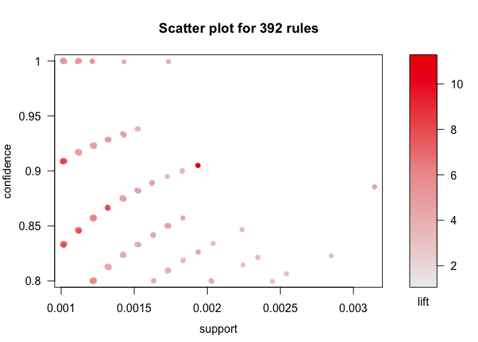<!-- -->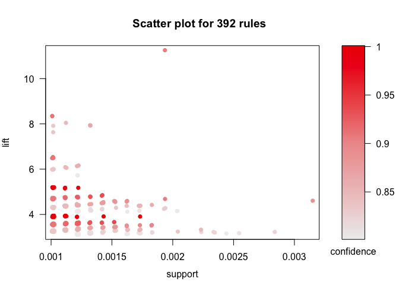<!-- -->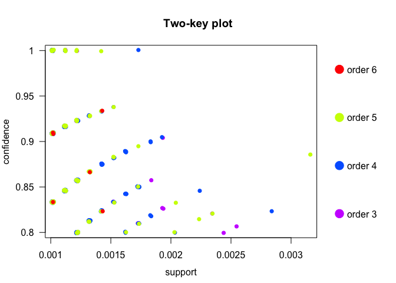<!-- -->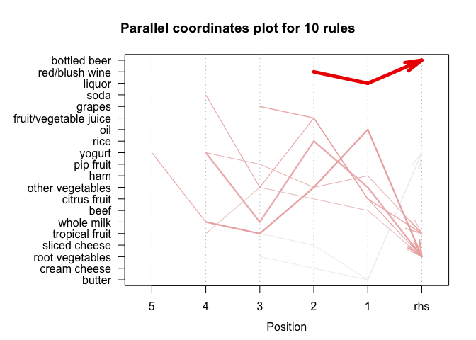<!-- -->

Here, we are selecting a subset by setting up thresholds on support and
confidence and analysing the behavior. The graph highlights the rule
with the highest lift, i.e other vegetables on citrus fruit, tropical
fruit, root vegetables and whole milk. This is bound to be the highest
performing rule within this subset.

    ## set of 8 rules
    ## 
    ## rule length distribution (lhs + rhs):sizes
    ## 3 4 5 
    ## 2 2 4 
    ## 
    ##    Min. 1st Qu.  Median    Mean 3rd Qu.    Max. 
    ##    3.00    3.75    4.50    4.25    5.00    5.00 
    ## 
    ## summary of quality measures:
    ##     support           confidence          lift           count      
    ##  Min.   :0.002034   Min.   :0.8065   Min.   :3.156   Min.   :20.00  
    ##  1st Qu.:0.002237   1st Qu.:0.8198   1st Qu.:3.208   1st Qu.:22.00  
    ##  Median :0.002339   Median :0.8225   Median :3.219   Median :23.00  
    ##  Mean   :0.002466   Mean   :0.8316   Mean   :3.394   Mean   :24.25  
    ##  3rd Qu.:0.002618   3rd Qu.:0.8365   3rd Qu.:3.274   3rd Qu.:25.75  
    ##  Max.   :0.003152   Max.   :0.8857   Max.   :4.578   Max.   :31.00  
    ## 
    ## mining info:
    ##       data ntransactions support confidence
    ##  Groceries          9835   0.001        0.8

    ##     lhs                        rhs                    support confidence     lift count
    ## [1] {citrus fruit,                                                                     
    ##      root vegetables,                                                                  
    ##      tropical fruit,                                                                   
    ##      whole milk}            => {other vegetables} 0.003152008  0.8857143 4.577509    31
    ## [2] {butter,                                                                           
    ##      other vegetables,                                                                 
    ##      pork}                  => {whole milk}       0.002236909  0.8461538 3.311549    22
    ## [3] {fruit/vegetable juice,                                                            
    ##      other vegetables,                                                                 
    ##      root vegetables,                                                                  
    ##      yogurt}                => {whole milk}       0.002033554  0.8333333 3.261374    20
    ## [4] {curd,                                                                             
    ##      domestic eggs,                                                                    
    ##      other vegetables}      => {whole milk}       0.002846975  0.8235294 3.223005    28
    ## [5] {herbs,                                                                            
    ##      tropical fruit}        => {whole milk}       0.002338587  0.8214286 3.214783    23
    ## [6] {citrus fruit,                                                                     
    ##      other vegetables,                                                                 
    ##      root vegetables,                                                                  
    ##      yogurt}                => {whole milk}       0.002338587  0.8214286 3.214783    23
    ## [7] {rolls/buns,                                                                       
    ##      root vegetables,                                                                  
    ##      tropical fruit,                                                                   
    ##      yogurt}                => {whole milk}       0.002236909  0.8148148 3.188899    22
    ## [8] {curd,                                                                             
    ##      hamburger meat}        => {whole milk}       0.002541942  0.8064516 3.156169    25

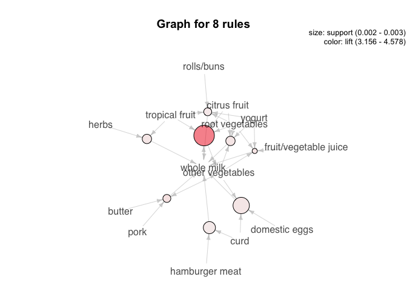<!-- -->

Checking for specific items, for example, whole milk. We can see that
with itemsets such as rice and sugar, canned fish and hygiene articles,
root vegetables, butter,rice etc, there is 100% probability that whole
milk will be purchased with it. Primarily, it looks like if there are
other dairy products in the basket, then there is 100% probability of
whole milk getting
    added.

    ##     lhs                     rhs              support confidence     lift count
    ## [1] {rice,                                                                    
    ##      sugar}              => {whole milk} 0.001220132          1 3.913649    12
    ## [2] {canned fish,                                                             
    ##      hygiene articles}   => {whole milk} 0.001118454          1 3.913649    11
    ## [3] {butter,                                                                  
    ##      rice,                                                                    
    ##      root vegetables}    => {whole milk} 0.001016777          1 3.913649    10
    ## [4] {flour,                                                                   
    ##      root vegetables,                                                         
    ##      whipped/sour cream} => {whole milk} 0.001728521          1 3.913649    17
    ## [5] {butter,                                                                  
    ##      domestic eggs,                                                           
    ##      soft cheese}        => {whole milk} 0.001016777          1 3.913649    10

Since the graphs here are not providing a lot of clarity, we will try
builing some through Gephi. First step is to save the Association rules,
so that it can be accessed by Gephi

Gephi image shared separately. The rendered Gephi image showcases the
association rules generated from Groceries. The size of the nodes
represents the degrees at each node. We can see that whole milk, other
vegetables, root vegetables, yogurt are connected to most other itemsets
and hence, has the highest degree in the plot.We have also filtered out
the degrees from 6 onwards, to reduce clutter. We also ran statistics to
understand the average path length between any two nodes and it turns
out to be 3.73.

\#Gephi image is sent seperately -
<https://github.com/udbhav13/PredictiveAnalytics-Assignment/blob/master/Groceries.png>
