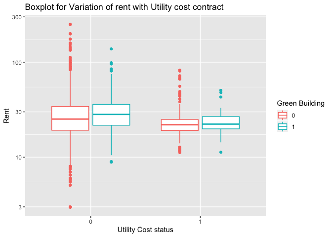

Market segmentation and Association rule mining
================

## Market segmentation

Consider the data in social\_marketing.csv. This was data collected in
the course of a market-research study using followers of the Twitter
account of a large consumer brand that shall remain nameless—let’s call
it “NutrientH20” just to have a label. The goal here was for NutrientH20
to understand its social-media audience a little bit better, so that it
could hone its messaging a little more sharply.

A bit of background on the data collection: the advertising firm who
runs NutrientH20’s online-advertising campaigns took a sample of the
brand’s Twitter followers. They collected every Twitter post (“tweet”)
by each of those followers over a seven-day period in June 2014. Every
post was examined by a human annotator contracted through Amazon’s
Mechanical Turk service. Each tweet was categorized based on its content
using a pre-specified scheme of 36 different categories, each
representing a broad area of interest (e.g. politics, sports, family,
etc.) Annotators were allowed to classify a post as belonging to more
than one category. For example, a hypothetical post such as “I’m really
excited to see grandpa go wreck shop in his geriatic soccer league this
Sunday\!” might be categorized as both “family” and “sports.” You get
the picture.

Each row of social\_marketing.csv represents one user, labeled by a
random (anonymous, unique) 9-digit alphanumeric code. Each column
represents an interest, which are labeled along the top of the data
file. The entries are the number of posts by a given user that fell into
the given category. Two interests of note here are “spam”
(i.e. unsolicited advertising) and “adult” (posts that are
pornographic, salacious, or explicitly sexual). There are a lot of spam
and pornography “bots” on Twitter; while these have been filtered out of
the data set to some extent, there will certainly be some that slip
through. There’s also an “uncategorized” label. Annotators were told to
use this sparingly, but it’s there to capture posts that don’t fit at
all into any of the listed interest categories. (A lot of annotators may
used the “chatter” category for this as well.) Keep in mind as you
examine the data that you cannot expect perfect annotations of all
posts. Some annotators might have simply been asleep at the wheel some,
or even all, of the time\! Thus there is some inevitable error and
noisiness in the annotation process.

Your task to is analyze this data as you see fit, and to prepare a
concise report for NutrientH20 that identifies any interesting market
segments that appear to stand out in their social-media audience. You
have complete freedom in deciding how to pre-process the data and how to
define “market segment.” (Is it a group of correlated interests? A
cluster? A latent factor? Etc.) Just use the data to come up with some
interesting, well-supported insights about the audience, and be clear
about what you did.

## Analysis:

Step 1: Data loading and exploration

You can include R code in the document as
    follows:

    ##     chatter        current_events        travel        photo_sharing    
    ##  Min.   :-1.3328   Min.   :-0.9926   Min.   :-0.8266   Min.   :-1.0910  
    ##  1st Qu.:-0.7621   1st Qu.:-0.6804   1st Qu.:-0.8266   1st Qu.:-0.7585  
    ##  Median :-0.2199   Median :-0.2193   Median :-0.2779   Median :-0.2104  
    ##  Mean   : 0.0000   Mean   : 0.0000   Mean   : 0.0000   Mean   : 0.0000  
    ##  3rd Qu.: 0.5673   3rd Qu.: 0.3929   3rd Qu.: 0.3446   3rd Qu.: 0.5381  
    ##  Max.   : 6.0866   Max.   : 7.8745   Max.   : 9.3242   Max.   : 6.4281  
    ##  uncategorized        tv_film        sports_fandom        politics      
    ##  Min.   :-0.7457   Min.   :-0.6698   Min.   :-0.8210   Min.   :-0.6996  
    ##  1st Qu.:-0.7457   1st Qu.:-0.6698   1st Qu.:-0.8210   1st Qu.:-0.6996  
    ##  Median :-0.2472   Median :-0.3603   Median :-0.2988   Median :-0.3640  
    ##  Mean   : 0.0000   Mean   : 0.0000   Mean   : 0.0000   Mean   : 0.0000  
    ##  3rd Qu.: 0.4115   3rd Qu.: 0.3028   3rd Qu.: 0.4384   3rd Qu.: 0.2873  
    ##  Max.   :11.4045   Max.   : 9.0381   Max.   : 7.7431   Max.   : 6.1638  
    ##       food             family        home_and_garden       music        
    ##  Min.   :-0.8476   Min.   :-0.7251   Min.   :-0.6211   Min.   :-0.6334  
    ##  1st Qu.:-0.8476   1st Qu.:-0.7251   1st Qu.:-0.6211   1st Qu.:-0.6334  
    ##  Median :-0.2450   Median :-0.3236   Median :-0.6211   Median :-0.6334  
    ##  Mean   : 0.0000   Mean   : 0.0000   Mean   : 0.0000   Mean   : 0.0000  
    ##  3rd Qu.: 0.4701   3rd Qu.: 0.4511   3rd Qu.: 0.4318   3rd Qu.: 0.3817  
    ##  Max.   : 7.7907   Max.   :11.7712   Max.   : 9.7835   Max.   :10.3297  
    ##       news         online_gaming         shopping       health_nutrition 
    ##  Min.   :-0.6036   Min.   :-0.51409   Min.   :-0.7878   Min.   :-0.6448  
    ##  1st Qu.:-0.6036   1st Qu.:-0.51409   1st Qu.:-0.7878   1st Qu.:-0.6448  
    ##  Median :-0.6036   Median :-0.51409   Median :-0.3061   Median :-0.4776  
    ##  Mean   : 0.0000   Mean   : 0.00000   Mean   : 0.0000   Mean   : 0.0000  
    ##  3rd Qu.: 0.2192   3rd Qu.: 0.07592   3rd Qu.: 0.4292   3rd Qu.: 0.2553  
    ##  Max.   : 9.0222   Max.   : 7.87723   Max.   : 6.5695   Max.   : 5.2058  
    ##   college_uni      sports_playing       cooking             eco        
    ##  Min.   :-0.6082   Min.   :-0.6405   Min.   :-0.6827   Min.   :-0.604  
    ##  1st Qu.:-0.6082   1st Qu.:-0.6405   1st Qu.:-0.6827   1st Qu.:-0.604  
    ##  Median :-0.3976   Median :-0.6405   Median :-0.3446   Median :-0.604  
    ##  Mean   : 0.0000   Mean   : 0.0000   Mean   : 0.0000   Mean   : 0.000  
    ##  3rd Qu.: 0.1425   3rd Qu.: 0.4343   3rd Qu.: 0.2425   3rd Qu.: 0.443  
    ##  Max.   : 6.5019   Max.   : 9.5705   Max.   : 5.6678   Max.   :11.174  
    ##    computers          business          outdoors           crafts       
    ##  Min.   :-0.5783   Min.   :-0.5488   Min.   :-0.6638   Min.   :-0.5978  
    ##  1st Qu.:-0.5783   1st Qu.:-0.5488   1st Qu.:-0.6638   1st Qu.:-0.5978  
    ##  Median :-0.5783   Median :-0.5488   Median :-0.6638   Median :-0.5978  
    ##  Mean   : 0.0000   Mean   : 0.0000   Mean   : 0.0000   Mean   : 0.0000  
    ##  3rd Qu.: 0.3388   3rd Qu.: 0.3831   3rd Qu.: 0.4401   3rd Qu.: 0.4168  
    ##  Max.   :11.9547   Max.   : 9.7018   Max.   : 8.5817   Max.   : 7.3710  
    ##    automotive           art              religion           beauty       
    ##  Min.   :-0.6238   Min.   :-0.46654   Min.   :-0.6257   Min.   :-0.5690  
    ##  1st Qu.:-0.6238   1st Qu.:-0.46654   1st Qu.:-0.6257   1st Qu.:-0.5690  
    ##  Median :-0.6238   Median :-0.46654   Median :-0.6257   Median :-0.5690  
    ##  Mean   : 0.0000   Mean   : 0.00000   Mean   : 0.0000   Mean   : 0.0000  
    ##  3rd Qu.: 0.3444   3rd Qu.: 0.09704   3rd Qu.: 0.2942   3rd Qu.: 0.3125  
    ##  Max.   : 9.7039   Max.   : 9.67793   Max.   : 7.5082   Max.   : 9.7571  
    ##    parenting           dating            school        personal_fitness 
    ##  Min.   :-0.6532   Min.   :-0.4313   Min.   :-0.6495   Min.   :-0.6627  
    ##  1st Qu.:-0.6532   1st Qu.:-0.4313   1st Qu.:-0.6495   1st Qu.:-0.6627  
    ##  Median :-0.6532   Median :-0.4313   Median :-0.6495   Median :-0.6627  
    ##  Mean   : 0.0000   Mean   : 0.0000   Mean   : 0.0000   Mean   : 0.0000  
    ##  3rd Qu.: 0.3620   3rd Qu.: 0.0856   3rd Qu.: 0.4307   3rd Qu.: 0.2873  
    ##  Max.   : 7.4163   Max.   : 8.9182   Max.   :11.5931   Max.   : 7.1080  
    ##     fashion        small_business         spam              adult       
    ##  Min.   :-0.6016   Min.   :-0.4888   Min.   :-0.06773   Min.   :-0.227  
    ##  1st Qu.:-0.6016   1st Qu.:-0.4888   1st Qu.:-0.06773   1st Qu.:-0.227  
    ##  Median :-0.6016   Median :-0.4888   Median :-0.06773   Median :-0.227  
    ##  Mean   : 0.0000   Mean   : 0.0000   Mean   : 0.00000   Mean   : 0.000  
    ##  3rd Qu.: 0.2955   3rd Qu.: 0.2557   3rd Qu.:-0.06773   3rd Qu.:-0.227  
    ##  Max.   : 8.6689   Max.   :11.7953   Max.   :32.08329   Max.   :11.569

<!-- --><!-- --><!-- -->
Few insights - \* Categories like fashion, beauty, dating etc are
correlated, similarly for . \* Categories like spam, adult are also
correlated

  - Categories such as spam, adult have high range but the values till
    3rd quartile are very low. For example in spam, 3rd quartile is
    -0.067 and maximum value is 32

To decide how many clusters exist in our data, let’s look at Elbow and
Silhouette plots to explore further.

<!-- -->

There is no elbow formation in the elbow plot. The silhouette plot is
also not able to decide upon a rational number of clusters for the
segment. 10 clusters in the data is too high to design a targeted
marketing strategy for the custome segments.

Let’s explore how 3,4,5 and 6 clusters look like.

<!-- -->

    ##   cluster Total.withinss betweenss
    ## 1       3       253144.8  30571.22
    ## 2       4       239827.6  43888.35
    ## 3       5       229105.6  54610.43
    ## 4       6       217597.7  66118.28
    ## 5       7       209949.0  73767.03

Clusters 5 and 6 are convoluted, having 3 and 4 clusters make more sense
for our business problem.

Let’s look at the CH index for clusters 3 to 7.

<!-- -->

Maximum value of CH index is 3 and there is a drop in CH value if number
of clusters is increased.

From the plot of clusters across PC 1 and 2, cluster 3 values look more
distinct in the principal component space.

Let’s explore what these principle comonents are actually made of
    -

    ## [1] "PC1 head"

    ##  [1] "religion"      "sports_fandom" "parenting"     "food"         
    ##  [5] "school"        "family"        "news"          "automotive"   
    ##  [9] "crafts"        "politics"

    ## [1] "PC1 tail"

    ##  [1] "personal_fitness" "health_nutrition" "online_gaming"   
    ##  [4] "uncategorized"    "college_uni"      "fashion"         
    ##  [7] "cooking"          "shopping"         "chatter"         
    ## [10] "photo_sharing"

    ## [1] "PC2 head"

    ##  [1] "chatter"        "politics"       "travel"         "shopping"      
    ##  [5] "automotive"     "current_events" "photo_sharing"  "news"          
    ##  [9] "computers"      "tv_film"

    ## [1] "PC2 tail"

    ##  [1] "religion"         "eco"              "dating"          
    ##  [4] "food"             "beauty"           "fashion"         
    ##  [7] "cooking"          "outdoors"         "personal_fitness"
    ## [10] "health_nutrition"

Cluster Profiling:

After looking at the top and bottom of first 2 principal components, we
can see there is group of people who are fitness enthisiasts and are
tweeting more about health, nutrition, food, cooking etc - Let’s call
them “Health Enthusiasts”

Similarly, there is another set of people who are more into talking
about politics, news, current events, parenting, businesss etc - Let’s
call them “Elderly”

And finaly, a third set of people who are into fashion, tv, films,
music, college and university etc - Let’s call them “Youth”

I have created macro categories by clubbing similar categories of tweets
based on the identifiction of interest areas for our 3 clusters. For
example health enthusiasts have all the health, fitness, food and
cooking replated tweets clubbed together and similalry for other
categories.

Cataegories such as adult, spam, uncategorized into others and are not
considered in creation of these macro categories of tweets.

Let’s look at the mean for these mcro categories by cluster -

    ## # A tibble: 3 x 4
    ##   cluster_final.cluster health.enthusiasts elderly youth
    ##                   <int>              <dbl>   <dbl> <dbl>
    ## 1                     1              18.9     8.49  16.4
    ## 2                     2               5.17   10.8   16.8
    ## 3                     3              12.5    15.6   14.5

Clearly, cluster 1 belongs to the “Health enthusiasts”, cluster 3 is the
group of “Elderly” and “Youth” is cluster 2.

Density plots shown below shows how the distribution of the points for
these macro categories across 3 clusters
-

<!-- --><!-- --><!-- -->
